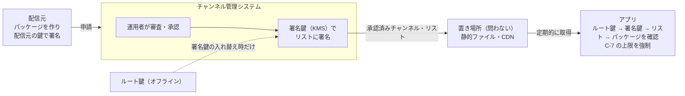

# ADR-001 第三者が配信するチャンネルは、運用者の審査と署名を経たものだけ取り込む

## 文書情報

| 項目 | 内容 |
|---|---|
| 文書ID | ADR-001 |
| ドキュメント種別 | ADR |
| 対象システム/機能 | SanpoGuide チャンネル（第三者が配信するチャンネルの取り込み） |
| 関連Skill | architecture-decision-record |
| 作成日 | 2026-10-03 |
| 作成者 | Claude（開発者との検討） |
| 承認者 | 開発者（2026-10-03） |
| ステータス | 承認済 |
| 版 | 1.1 |

## 目的・背景

[TODO.md「チャンネル」](../TODO.md#チャンネル)で、語り手・話題・話す量・雰囲気をまとめて切り替える「チャンネル」を導入することにした。チャンネルを作るのは、アプリに組み込みのもの（利用者が設定でカスタマイズできる）と、第三者が配信するものの 2 者。第三者のチャンネルの話しかけの頻度・雰囲気は配信元が決める（2026-10-03 の決定）。

第三者のチャンネルには、組み込みのチャンネルにない次の問題がある。

1. **費用**: AI は利用者の API キーで呼ぶ。第三者のプロンプトや話しかけの頻度で、利用者の費用が増える
2. **内容の安全性**: 第三者のプロンプトに、不適切な話し方、宣伝の混入、位置や個人情報を聞き出す指示が入るおそれがある
3. **出どころ**: 取り込んだチャンネルが本当にその配信元のものか、途中で書き換えられていないかを確かめる手段がない

開発者から「システム運用者が品質を担保し、基準を満たしたチャンネルだけ取り込む」方針が示された。本書はその方針と、方針を成り立たせるために補った仕組みを記録する。

## スコープ・非スコープ

スコープ:
- 第三者のチャンネルを、アプリが取り込んでよいと判断する仕組み（審査・署名・取り下げ）
- 審査の結果にかかわらず、アプリが必ず強制すること
- チャンネルの置き場所と取り込み方の大枠

非スコープ（別途決める）:
- チャンネルのパッケージの形式（契約書として別に作る。[追従タスク](#影響範囲追従タスク) T-2）
- 審査基準の具体的な中身（T-1）
- 組み込みのチャンネルの設計（本書の決定に依存しないので、先に進めてよい）
- 場所に紐づく第三者のコンテンツの配信（[TODO「第三者の媒体」](../TODO.md#第三者の媒体広告の再生)・[API-001](../secret-messages-api.md) の `publisher`）

## 対応元ID（トレーサビリティ）

| 対応元ID | 内容 | 対応状況 |
|---|---|---|
| 該当なし | TODO.md「チャンネル」の「決めること」（配信方法と配信元の確認、上限、AI の費用、プロンプトの安全性） | 本書で対応 |
| API-001 | 秘密メッセージ サーバー API。D-5（公式サーバーを前提にしない）と、Ed25519 のアカウントID | 考え方と鍵の仕組みを流用 |

## 方針・決定事項

| No. | 論点 | 決定 |
|---|---|---|
| C-1 | 取り込んでよいチャンネル | システム運用者が審査し、基準を満たしたチャンネルだけ。審査に通ったことは運用者の署名で示す |
| C-2 | 署名の対象と鍵 | 運用者は、承認済みチャンネル・リスト（各パッケージの SHA-256 を含む）に Ed25519 で署名する。パッケージごとの運用者の署名は要らない。鍵は 2 段で、オフラインのルート鍵が、管理システムの使う署名鍵（有効期限付き）に署名する。アプリが信用するのはルート鍵だけ（[API-002](../channel-list-api.md) P-1・P-4） |
| C-3 | 更新 | パッケージの中身が変わればハッシュが変わるので、更新のたびに審査と署名をやり直す。審査後に中身を差し替えても、アプリは取り込まない |
| C-4 | 配信元の身元 | パッケージに配信元のアカウントID（API-001 と同じ `sg1…`）を入れ、配信元も署名する。同じチャンネルの更新は、同じ配信元の署名があるときだけ受け付ける（管理システムが申請時に確かめる）。例外は C-11 の移し替えだけ |
| C-5 | 置き場所と取り込み方 | アプリは承認済みチャンネル・リストを取得して取り込む。リストとパッケージの置き場所は問わない（静的ファイル・CDN で足りる）。リストの取得先（提供元）は設定で変えられ、既定はアプリに内蔵した提供元。ほかに、配信元が審査前に自分の端末で試す試用チケット（開発者モードのときだけ）がある |
| C-6 | 取り下げ | リストに載っていないチャンネルは使わない。問題があって止めたものはリストの `revoked` に理由とともに載せる。リストには通し番号と有効期限（最大 14 日）を付け、古いリストへの差し戻しを防ぐ。別の失効リストは作らない（API-002 P-5・P-6） |
| C-7 | アプリが必ず強制すること（審査の結果にかかわらず） | 安全の案内（天気の急変・雷雨の通知・日の入り）は止められない。共通ルール（`prompts/shared/`）は必ず付ける。話しかけの頻度・プロンプトの長さ・背景音の音量に上限を設ける。第三者が差し替えられるのは語り手と話題の部分だけ |
| C-8 | 審査基準 | 文書にして公開する。機械で確かめる項目（形式・長さ・上限・使ってはいけない変数や指示）と、人が確かめる項目（プロンプトの内容、いくつかの場面で実際に話させた結果、宣伝の扱い、事実の正確さ）に分ける |
| C-9 | 審査と公開の場所 | アプリとは別の **チャンネル管理システム** で行う。利用者は運用者（審査・承認・取り下げ）と配信元（申請・更新・審査状況の確認・試用チケットの発行）。承認すると管理システムがリストを作り、KMS の署名鍵で自動で署名して公開する。管理システムの実装方法・置き場所は、API-002 に準拠していれば問わない |
| C-10 | システム運用者 | 当面は開発者本人が務める（内蔵の提供元の運営、審査・承認・取り下げ、ルート鍵の保管）。外部に任せる・複数にするときは[見直しの条件](#影響範囲追従タスク)にあたる |
| C-11 | 配信元の鍵をなくした・漏れたとき（1.1 で追加） | 運用者が本人確認のうえで、チャンネルを新しい鍵（新しいアカウントID）に移せる。本人確認は、管理システムのアカウント（Cognito）と、登録済みの連絡先など鍵とは別の経路で行う。移したあとの最初の版は通常どおり審査する。漏れたときは、古い鍵で署名された承認待ちの版を差し戻し、必要なら公開中の版を取り下げる。リストには `publisherChange` で移し替えを示し、アプリは利用者に一度知らせる（[API-002](../channel-list-api.md) P-9） |
| C-12 | 管理システムの実装（1.1 で追加） | 別リポジトリ sanpo-channel-console で、AWS（API Gateway・Lambda・DynamoDB・S3/CloudFront・KMS・Cognito）に作る。詳細は同リポジトリの ADR-001（2026-10-03 承認）。KMS の署名の大きさの制限から、リストは要約に署名する（API-002 P-8） |

## 判断テーマ

第三者が配信するチャンネルについて、品質（費用・内容の安全性・出どころ）を誰が、どの仕組みで担保するか。

## 検討した代替案と比較軸

比較軸: ①利用者の安全と費用 ②アプリが自分で確かめられるか ③運用の負担 ④配信元の自由度 ⑤API-001 の「公式サーバーを前提にしない」考え方との整合

| 案 | 内容 | 評価 |
|---|---|---|
| 案 1 | 審査なし。誰でも URL で配信でき、アプリ側の上限（C-7）だけで守る | ①× 上限の範囲内でも、不適切な語り口や宣伝は防げない ②△ ③◎ ④◎ ⑤◎ |
| 案 2 | 配信元の署名だけ。身元は分かるが内容は審査しない。信用するかは利用者が判断する | ①△ 利用者に判断を任せることになる ②○ ③◎ ④◎ ⑤◎ |
| **案 3（採用）** | 運用者が審査し、署名したものだけ取り込む。アプリ側の上限と取り下げも併用する | ①◎ ②◎ 署名で確かめられる ③△ 審査の手間がかかる ④○ C-7 の範囲内で自由 ⑤○ 置き場所は問わない |
| 案 4 | 運用者がストアのサーバーを運営し、アプリはそこからだけ取得する | ①◎ ②○ サーバーを信用することになる ③× サーバーの運用が要る ④○ ⑤× |
| 案 5 | 第三者の配信はやめ、組み込みのチャンネルだけにする | ①◎ ②◎ ③◎ ④× 要件（第三者が配信する）を満たさない ⑤◎ |

第 0.2 版で加えた論点（2026-10-03、開発者の回答）:

| 論点 | 案 | 判定と理由 |
|---|---|---|
| リストへの署名の場所 | 管理システムの中で自動（KMS） / 運用者の手元で手作業 | **管理システムの中**。承認のたびの手作業をなくす。乗っ取られたときの備えとして、ルート鍵をオフラインに置く 2 段の鍵にし、アプリを更新せずに署名鍵を失効・入れ替えできるようにした |
| リストの取得先 | アプリに内蔵した URL だけ / 設定で変えられる | **設定で変えられる**（既定は内蔵の提供元）。API-001 の D-5 と同じく、特定の運用者に縛らない。どの提供元を信用するかは利用者の判断になるため、提供元IDは利用者が別の経路で得たものと照合する |
| 取り込みの経路 | 承認済みリストだけ / リスト＋試用チケット | **リスト＋試用チケット**。配信元が審査前に実機で試せるようにする。開発者モードだけ・7 日以内・共有不可にとどめる |

## 採用案と採否理由

案 3 を採用する。

- 開発者の方針（運用者が品質を担保する）をそのまま実現できる
- 「審査済み」をアプリが署名で確かめられるので、置き場所や通信経路を信用しなくてよい。専用のサーバーも要らず、API-001 の D-5 の考え方と矛盾しない
- 審査だけでは防げないもの（AI の返答は毎回違うため、審査時に問題がなくても散歩中に不適切なことを話しうる）を、アプリ側の上限（C-7）と取り下げ（C-6）で補う

却下した理由:
- 案 1・案 2: 内容の安全性を利用者に負わせることになり、開発者の方針に合わない
- 案 4: 審査済みかどうかの判断を「どこから取得したか」に頼るため、ストアのサーバーを常に運営し、信用し続ける必要がある。案 3 なら署名で同じことができる
- 案 5: 第三者が配信するという要件を満たさない

利点:
- 利用者は、審査済みのチャンネルだけを安心して使える
- 安全の案内・共通ルール・上限は、どのチャンネルでも同じに働く
- 配信元は、置き場所を自由に選べる

注意点:
- 審査の手間が運用者にかかる。申請が増えると、審査待ちが長くなる
- 運用者の鍵の管理が重要になる。ルート鍵をなくすと署名鍵を入れ替えられず、内蔵の提供元のルート鍵を入れ替えるにはアプリの更新が要る。署名鍵は管理システムの中にあるので、管理システムが乗っ取られると、署名鍵を失効させるまで偽のリストが出せる
- チャンネル管理システムという、アプリとは別のシステムを作って運用する必要がある
- リストを取りに行く通信が増える（位置情報は送らない）

## 影響範囲・追従タスク

| 観点 | 影響 |
|---|---|
| 実装 | アプリに提供元の設定、リストの定期取得、署名とハッシュの確認、試用チケットの読み込み、C-7 の上限の強制、取り下げ時の切り替えが加わる。署名の確認は API-001 のために入れる Tink（Ed25519）を共用できる。アプリとは別にチャンネル管理システムを作る |
| 運用 | ルート鍵の作成と保管（オフラインで複数の場所に）、署名鍵の入れ替え、審査、取り下げ、管理システムの運用が運用者の仕事になる |
| テスト | API-002 の確認観点 V-01〜V-14。配信元の違う更新を拒むテスト。C-7 の上限を超えるパッケージを拒むテスト。`PromptFilesTest` を第三者のチャンネルの見本でも回す |
| 移行 | 既存の機能・データへの影響はない（新しい機能のため） |
| 保守 | 審査基準とパッケージの形式を版で管理する。アプリが知らない版のパッケージは取り込まない |
| プライバシー | リストの取得を README の外部サービスの一覧に加える |

| ID | 追従タスク | 担当 | 時期 |
|---|---|---|---|
| T-1 | 審査基準の文書を作る（機械で確かめる項目と人が確かめる項目、宣伝の扱い）。草案: [channel-review-policy.md](../channel-review-policy.md)（2026-10-03） | 開発者・Claude | 第三者のチャンネルの実装の前 |
| T-2 | 承認済みチャンネル・リストの契約書（[API-002](../channel-list-api.md)、承認済み）と、パッケージの形式の契約書（API-003。上書きできるもの、上限、配信元の署名、版） | 開発者・Claude | T-1 と並行 |
| T-3 | ルート鍵の作成・保管と、署名鍵（KMS）の入れ替え・失効の手順を決める | 開発者 | アプリに提供元IDを内蔵する前 |
| T-4 | チャンネル管理システムを作る（要件を詰めてから。配信元の申請・試用チケット、審査用の道具（機械で確かめる項目のチェックと、場面ごとに話させた見本の書き出し）、承認・取り下げ、リストの作成と署名・公開） | 開発者・Claude | T-2 の後 |
| T-5 | アプリに提供元の設定・リストの取得と確認・試用チケット・上限の強制を実装する | Claude | T-2・T-3 の後 |
| T-6 | README（外部サービス・プライバシー）を更新する | Claude | T-5 と同時 |

見直しの条件:
- 運用者を複数にする、または審査を外部に任せることになったとき（鍵の持ち方と審査の分担を見直す）
- 審査待ちが長くなり、配信元の不満や運用者の負担が問題になったとき
- AI の費用の持ち方が変わったとき（例: 配信元や運用者が AI の費用を持つ）。C-7 の上限を見直す
- 運用者の鍵が漏れた、またはなくしたとき
- Google Play の AI 生成コンテンツ・利用者が作るコンテンツの規約が変わったとき

## 制約

- 対応端末は Android 8.0（API 26）以上。Ed25519 は Android Keystore では扱えないため、署名の確認は Tink で行う（API-001 と同じ）
- 運用者の公開鍵はアプリに内蔵するため、入れ替えにはアプリの更新が要る

## 未決事項・リスク

| No. | 内容 | 決める時期 |
|---|---|---|
| 1 | ~~システム運用者は誰か~~ → 解決（2026-10-03、C-10） | — |
| 2 | 宣伝を目的としたチャンネル（店舗・企業）を認めるか。認める場合の表示 | T-1 の前 |
| 3 | 審査を無料にするか有料にするか（収益化の方針とつながる） | 第三者のチャンネルの公開の前 |
| 4 | 第三者のチャンネルを利用者がカスタマイズできるか（今の決定では配信元に任せ、利用者は使う・使わないだけを選ぶ） | T-2 |

リスク:
- 審査で見落とした問題が、取り下げまでの間に利用者に届く。リストの取得の間隔（24 時間）と有効期限（最大 14 日）で被害の大きさが決まる
- 管理システムが乗っ取られると、署名鍵を失効させるまで偽のリストが出せる
- 運用者が 1 人だと、不在の間は審査も取り下げもできない

## 関連ドキュメント・参照リンク

- [TODO.md「チャンネル」](../TODO.md#チャンネル)
- [channel-list-api.md（API-002）](../channel-list-api.md): 承認済みチャンネル・リストの形式
- [secret-messages-api.md（API-001）](../secret-messages-api.md): 鍵とアカウントID、D-5
- [prompts.md](../prompts.md): プロンプトの構成（第三者が差し替える範囲を決める元）
- 検討の記録: [skill-logs/adr_2026-10-03.md](../skill-logs/adr_2026-10-03.md)

## 変更履歴

| 日付 | 版 | 変更内容 | 変更者 |
|---|---|---|---|
| 2026-10-03 | 0.1 | 草案 | Claude |
| 2026-10-03 | 0.2 | チャンネル管理システムを別に置く決定を反映（C-2・C-5・C-6 を変更、C-9 を追加、未決事項 No.4 を解消） | Claude |
| 2026-10-03 | 0.3 | システム運用者を当面は開発者とする決定を C-10 に追加（未決事項 No.1 を解消） | Claude |
| 2026-10-03 | 1.0 | 承認 | Claude（承認: 開発者） |
| 2026-10-03 | 1.1 | C-4 に管理システムが確かめることと例外を明記。C-11（配信元の鍵の移し替え）、C-12（管理システムの実装）を追加 | Claude（承認: 開発者） |
