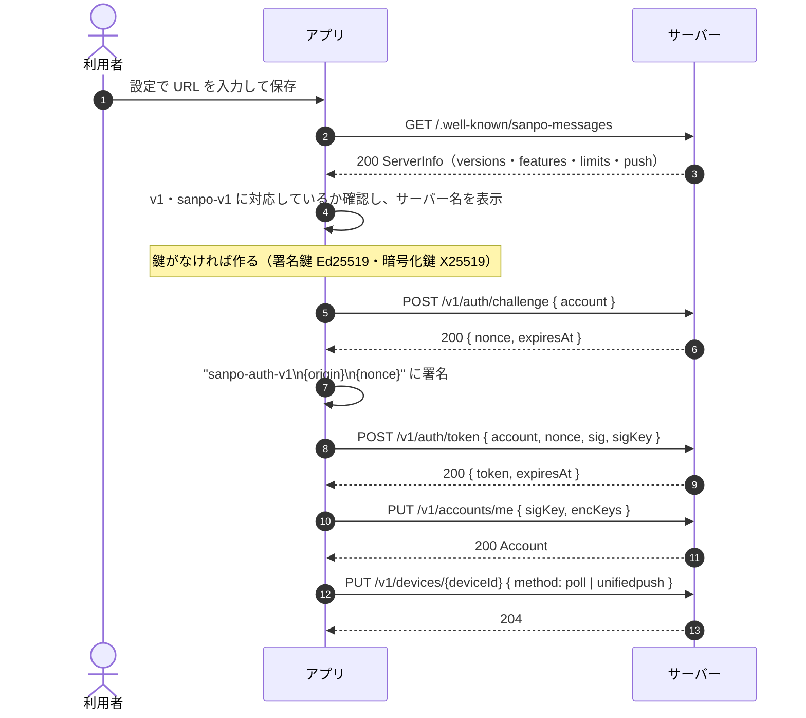
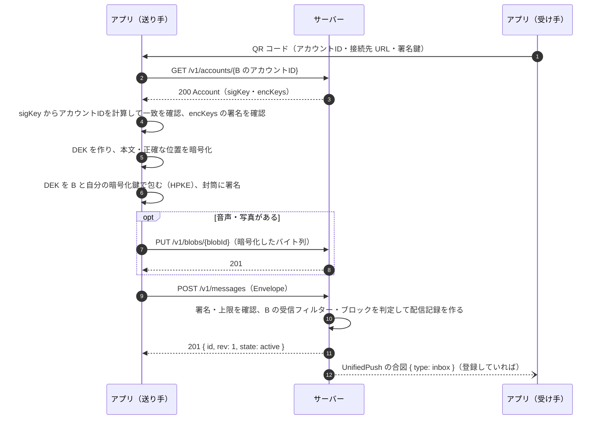
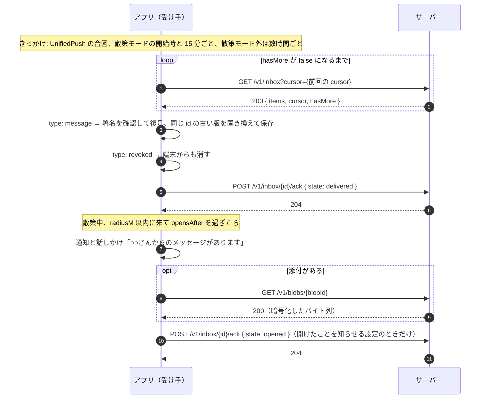
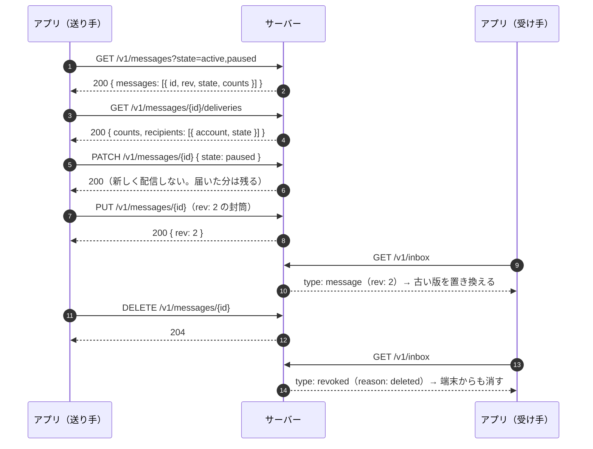
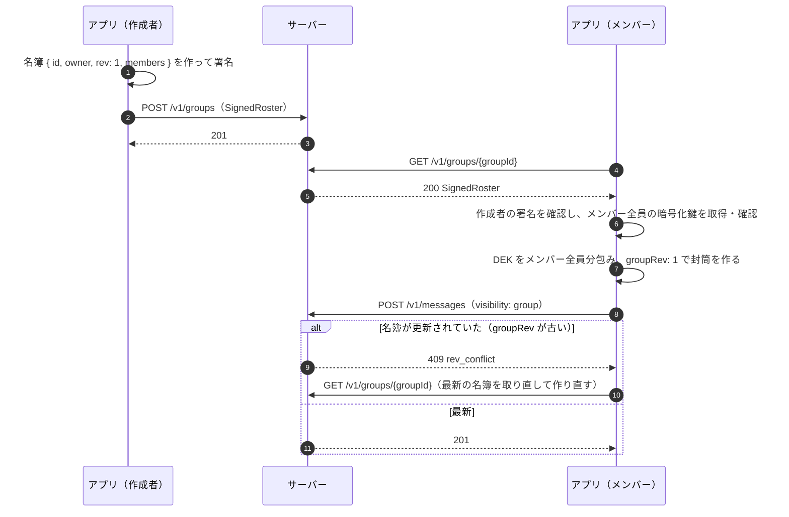
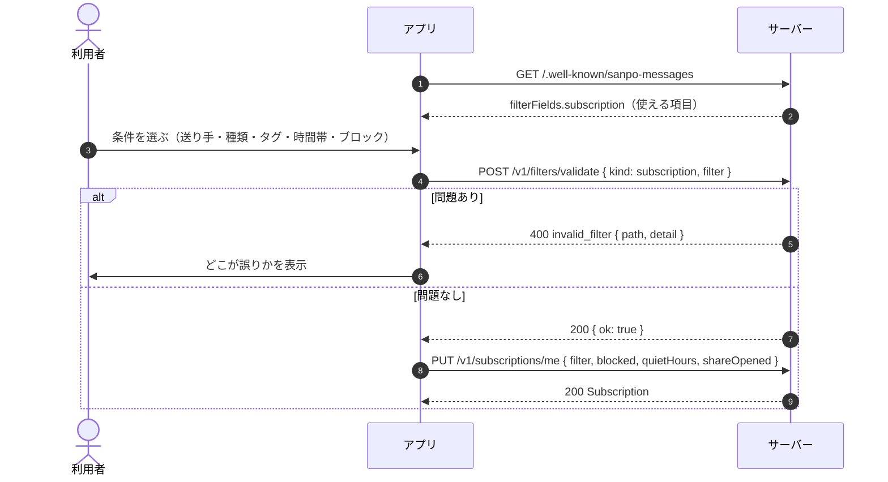
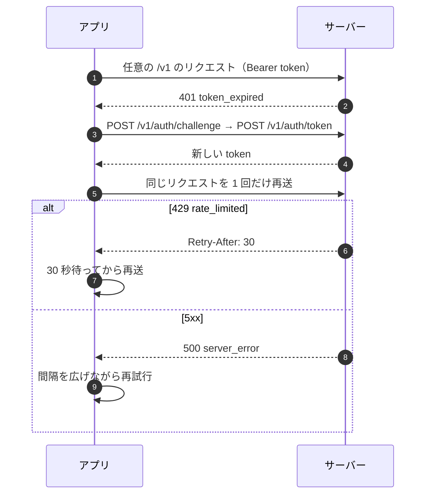

# 秘密メッセージ サーバー API（OpenAPI）の説明と使い方

[sanpo-messages.openapi.yaml](sanpo-messages.openapi.yaml) は、位置に紐づく秘密メッセージのサーバー API を OpenAPI 3.1 で書いたもの。サーバーを作る人とアプリを作る人が、同じ定義を見て実装するためのファイル。

- **正本は契約書** [../secret-messages-api.md](../secret-messages-api.md)（API-001）。判断の理由・暗号方式・配信の判定規則は契約書にある。食い違いがあれば契約書に合わせてこのファイルを直す
- サーバーは、この API に準拠していれば実装方法（言語・フレームワーク・データベース）も置き場所も問わない。アプリは設定の URL だけで接続先を選ぶ

## フォルダーの中身

| ファイル | 内容 |
|---|---|
| `sanpo-messages.openapi.yaml` | API の定義（エンドポイント、リクエスト・レスポンスの形、エラー） |
| `redocly.yaml` | 検証ツール（Redocly CLI）の設定。意図して外したルールと理由 |
| `README.md` | このファイル |

## 見る・検証する

Node.js があれば、インストールなしで使える。

```sh
cd docs/api

# 検証（定義の書き間違いを見つける）
npx @redocly/cli lint sanpo-messages.openapi.yaml

# 読みやすい HTML にする（ブラウザーで開く。生成物はコミットしない）
npx @redocly/cli build-docs sanpo-messages.openapi.yaml -o api.html
```

ほかの見方:
- VS Code の拡張機能「OpenAPI (Swagger) Editor」などで、エディターの中でプレビューできる
- [Swagger Editor](https://editor.swagger.io/) にファイルの中身を貼る（外部のサイトに送ることになる点に注意）
- この README のシーケンス図（Mermaid）は GitHub の画面、または VS Code の Markdown プレビュー（Mermaid 対応の拡張機能が必要）で図になる

## 定義の読み方

### 独自の項目 `x-sanpo-feature`・`x-sanpo-release`

各操作に、その操作が属する機能と版を付けている。

| `x-sanpo-feature` | 内容 | 版 |
|---|---|---|
| `core` | 検出・認証・アカウント・通報。すべての準拠サーバーが実装する | 1 |
| `direct` | 個人宛てのメッセージ、管理、受信箱、添付、プッシュ | 1 |
| `group` | グループ | 1 |
| `subscription` | 受信フィルター | 1 |
| `admin` | 運営 API | 2 |

サーバーは対応する機能を検出 API（`/.well-known/sanpo-messages`）の `features` で知らせる。`features` にない機能の操作には `400 unsupported_feature` を返す。アプリは `features` にある機能だけを画面に出す。

`public`（公開メッセージ）・`audience`（配信条件）・`publisher` も第 2 版の機能だが、専用のエンドポイントはなく、既存の操作の項目（封筒の `visibility: public`、受信箱の `cells` など）として入る。スキーマの説明で **［第 2 版］** と書いてある項目がそれにあたる。

### 封筒（`Envelope`）は二重構造

メッセージは「封筒」で送る。封筒の `protected` は base64url で包んだ JSON で、中身の形は `EnvelopeHeader` スキーマに書いてある（OpenAPI の `contentSchema`）。

```
Envelope
├── protected  … base64url(EnvelopeHeader の JSON)  ← サーバーが読む（宛先・種類・期間など）
├── ciphertext … base64url(nonce + 暗号文)          ← サーバーは読めない（本文・正確な位置）
└── sig        … protected + "." + ciphertext への送り手の署名
```

サーバーは `protected` を読んで配信に使うが、**受け取った 3 つの文字列を変えずに保存して返す**こと（整形すると署名が合わなくなる）。グループの名簿（`SignedRoster` → `Roster`）も同じ構造。

### エラー

エラーはすべて `application/problem+json`（RFC 9457）で、`code` で種類を見分ける。応答の定義（`components/responses`）の説明に、その HTTP ステータスで返りうる `code` を書いている。`code` ごとのクライアントの動き方は契約書の「エラー表」を参照。

### スキーマで表せないルール

次は OpenAPI では書けないため、説明文と契約書にだけある。準拠テストで確認する。

- 署名の検証（封筒・名簿・チャレンジ）
- フィルター式の入れ子は 4 段まで、条件は合計 32 個まで
- 同じ封筒の再送は `200` で同じ結果、中身が違えば `409 id_conflict`
- 更新の `rev` は今の版 + 1
- 配信の判定（宛先 → 受信フィルター → ブロック）

## 使い方の流れ（シーケンス図）

図の「アプリ」は SanpoGuide、「サーバー」は設定した URL の準拠サーバー。暗号の処理（鍵の作成・暗号化・署名）はすべてアプリの中で行う。

### 1. 接続先の確認と初回登録

設定画面で URL を保存したときの流れ。以後のリクエストはすべてトークンを付ける。



リクエストの例:

```http
POST /v1/auth/token HTTP/1.1
Content-Type: application/json

{ "account": "sg1abcd…", "nonce": "q3v…", "sig": "MEU…", "sigKey": "11qY…" }
```

```http
HTTP/1.1 200 OK
Content-Type: application/json

{ "token": "eyJ…", "expiresAt": "2026-09-30T11:00:00+09:00" }
```

### 2. 友だちを追加して、メッセージを置く

公開鍵は対面の QR コードで交換する。サーバーから取った鍵は、QR コードで得たアカウントIDと照合してから使う。



`POST /v1/messages` の応答が届かなかったときは、**同じ封筒をそのまま再送する**（`200` で同じ結果が返る）。作り直すと別のメッセージになる。

### 3. 受け取って、その場所で開ける



`cursor` は端末に保存しておき、次の取得で渡す（差分だけが返る）。第 1 版では `cells` を送らないので、サーバーは受け手の位置を知らない。

### 4. 送り手がメッセージを管理する



- 2 台の端末から同時に更新すると、遅いほうは `409 rev_conflict` になる。`GET /v1/messages/{id}` で最新を取り直して作り直す
- `ended`（期限切れ）の再開や、`deleted` の更新は `409 invalid_state`

### 5. グループで送る



名簿の署名を確認するので、サーバーが勝手にメンバーを足しても送り手が気づける。

### 6. 受信フィルターを設定する



フィルター式の例（友だちとグループからは全部、それ以外はイベントとお知らせだけ）:

```json
{
  "any": [
    { "field": "message.visibility", "op": "in", "value": ["direct", "group"] },
    { "field": "message.category", "op": "in", "value": ["event", "notice"] }
  ]
}
```

### 7. トークンの期限切れ・エラーへの対応



## 立場ごとの使い方

### サーバーを作る人

1. 契約書の「サーバーの準拠要件」を読む
2. このファイルから、使う言語のサーバーのひな形を生成してもよい（例: [OpenAPI Generator](https://openapi-generator.tech/)）。生成しなくても、この定義どおりに応答すれば準拠できる
3. 第 1 版は `x-sanpo-release: 1` の操作をすべて実装し、検出 API の `features` を `["direct", "group", "subscription"]` にする
4. 準拠テスト（作成予定。任意のサーバーの URL に対して流せるもの）で確認する

### アプリを作る人

- 接続先は設定の URL だけで決める。特定のサーバーの名前や証明書を埋め込まない
- リクエスト・レスポンスのデータクラスは、このファイルから生成しても、手で書いてもよい（既存の API クライアントは OkHttp と手書きの JSON 処理）
- 検出 API の `features`・`limits`・`filterFields` に合わせて、画面に出す機能と入力の上限を変える
- 署名の合わない封筒、名簿と合わない配信など、準拠していない応答は使わずに捨てる

## 定義を変えるとき

1. 先に契約書を直し、承認をとる（変更履歴に追記）
2. このファイルを直して `npx @redocly/cli lint sanpo-messages.openapi.yaml` を通す
3. 項目・エンドポイントの追加は互換性のある変更。既存の項目の意味の変更・削除は `/v2` を検討する（契約書の「互換性方針」）
