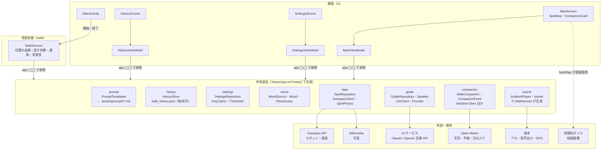
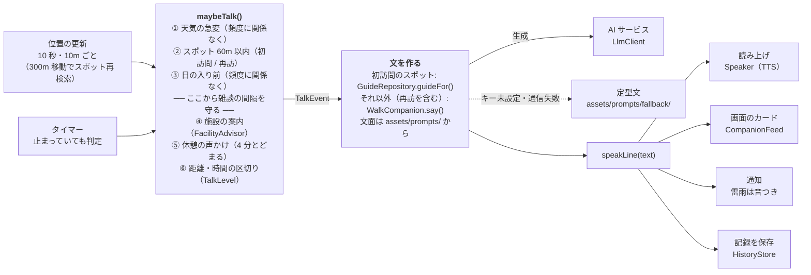
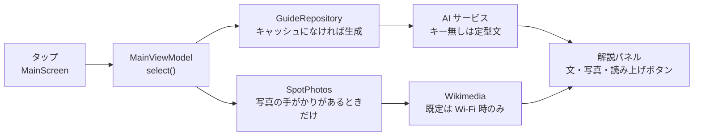
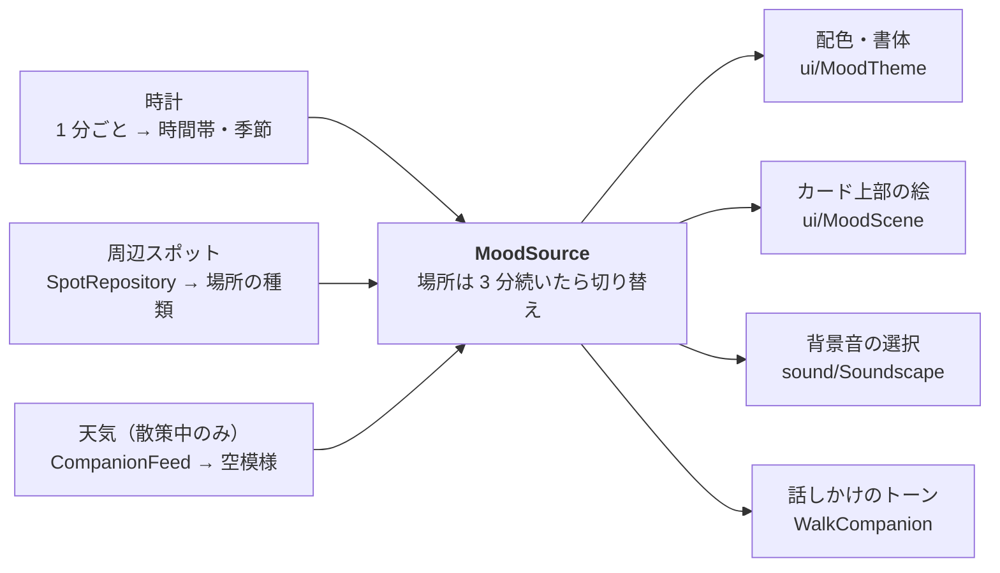

# 散策ガイドの構造図

アプリ全体を 4 枚の図で説明する。図 1 で「どこに何があるか」をつかみ、図 2〜4 で散策モードの話しかけ・スポット解説・雰囲気という 3 つの主要な流れを追う。

- ソース 41 ファイル / 約 5,050 行、パッケージ 10
- 画面 3（メイン・設定・記録）、常駐サービス 1（`WalkService`）、外部サービス 5

図はコードから手で書き起こしたもの。`WalkService` の判定順を変えたり、パッケージを追加したりしたときは、この文書も更新する。

## 図 1 · 全体: 画面とサービスは、SanpoApp が持つ共有部品を使う

DI ライブラリは使っていない。`SanpoApp.onCreate()` が部品を 1 つずつ作り、画面の ViewModel と `WalkService` は `(application as SanpoApp).spots` のように直接取り出す。

`WalkService` がアプリの中心。散策モード中は画面を閉じても動き続け、位置・天気・周辺スポットを見て「いま何を話すか」を決める。`sound` だけは SanpoApp ではなく、WalkService が必要になったときに作る。

## 図 2 · 散策モード: 話しかけるまでの流れ

位置が更新されるたびと、一定間隔のタイマーで `maybeTalk()` が呼ばれる。判定は上から順に行い、最初に当たった 1 件だけを話す。

- 順番はコードの判定順（`walk/WalkService.kt` の `maybeTalk()`）そのまま。README の表とは並びが違い、実際には「スポット」が「日の入り」より先に判定される。
- 天気と日の入りは安全に関わるため、話しかけの頻度設定を無視する。
- 読み上げ中は判定しない（`Speaker.isSpeaking` と `Mutex` で 1 件ずつ）。
- 記録の保存は、スポット案内・距離の区切り・散歩の終了のときに行う。

## 図 3 · スポット解説: 地図でスポットをタップしたとき

解説と写真は別々に取りに行く。解説は「AI サービス・モデル・スポット」の組み合わせでキャッシュするため、同じスポットで料金がかかるのは 1 回だけ。

読み上げは自動では始まらず、パネルのボタンで `Speaker` に渡す。散策モードで初訪問のスポットに近づいたときも同じ `GuideRepository.guideFor()` を使うので、キャッシュは両方で共有される。

## 図 4 · 雰囲気: 1 つの「雰囲気」を画面・音・話し方で共有する

`MoodSource` が 3 つの入力をまとめて現在の `Mood`（時間帯 × 季節 × 空模様 × 場所）を作り、4 か所がそれを読む。

設定の「雰囲気に合わせる」をオフにすると、配色・絵・話し方は雰囲気を使わなくなる。背景音の選択だけは常に雰囲気を使う。

## パッケージ一覧

パスは `app/src/main/java/com/example/sanpoguide/` からの相対。行数は空行・コメントを含む。

| パッケージ | 役割 | 主なファイル | 行数 |
|---|---|---|---:|
| `ui` | Compose の 3 画面、地図、発言カード、雰囲気の配色と絵、ViewModel | MainScreen, SettingsScreen, MoodScene, MainViewModel | 1,912 |
| `companion` | 散歩の友の発話、散歩中の状態、画面向けの発言、天気の取得と急変判定、施設案内の判定 | WalkCompanion, WalkSession, FacilityAdvisor, WeatherClient | 612 |
| `data` | Overpass でのスポット・施設検索、現在地とスポットの共有状態、Wikimedia の写真 | OverpassClient, SpotRepository, SpotPhotos | 515 |
| `sound` | 背景音の選択・その場での合成・再生 | Soundscape, Voices, AmbientPlayer | 436 |
| `walk` | 散策モードのフォアグラウンドサービス。いつ何を話すかを決める | WalkService | 404 |
| `guide` | AI サービスの抽象と実装、スポット解説とキャッシュ、TTS | GuideRepository, ClaudeClient, OpenAiCompatibleClient, Speaker | 342 |
| `settings` | 設定の保存、API キーの暗号化、話しかけの頻度、しきい値 | SettingsRepository, KeyCipher, TalkLevel, Threshold | 250 |
| `mood` | 雰囲気のモデル、場所の種類の推定、現在の雰囲気 | Mood, PlaceGuess, MoodSource | 186 |
| `history` | 散歩の記録（端末内 JSON、最新 500 件）と再訪の判定 | HistoryStore | 173 |
| `prompt` | プロンプトファイルの読み込みと変数の埋め込み | PromptTemplates, Prompts | 132 |
| (root) | 共有部品の生成、通知チャンネルの登録 | SanpoApp | 88 |

## 変更の入口: こうしたいときはここを開く

| やりたいこと | 最初に開くファイル |
|---|---|
| 話しかけ・解説の文面を変える | `assets/prompts/`（一覧は [prompts.md](prompts.md)） |
| 話す条件や優先順位を変える | `walk/WalkService.kt` の `maybeTalk()` |
| 距離・時間・気温などの既定値を変える | `settings/Threshold.kt` |
| 話しかけの頻度の段階を変える | `settings/TalkLevel.kt` |
| 施設案内の条件を変える | `companion/FacilityAdvisor.kt` |
| AI サービスを追加する | OpenAI 互換なら `guide/Provider.kt` に 1 行。独自 API なら `LlmClient` を実装して `GuideRepository.createClient` に分岐を足す |
| 検索するスポットの種類を変える | `data/OverpassClient.kt` |
| 配色・絵・背景音の選び方を変える | `ui/MoodTheme.kt`・`ui/MoodScene.kt`・`sound/Soundscape.kt` |
| 記録の保存形式や再訪の判定を変える | `history/HistoryStore.kt` |

## 計画中: 位置に紐づく秘密メッセージ

アプリの外にメッセージサーバーを置く予定。API の契約（[secret-messages-api.md](secret-messages-api.md)）と OpenAPI（[api/sanpo-messages.openapi.yaml](api/sanpo-messages.openapi.yaml)）はできているが、アプリ側・サーバー側ともまだ実装されていないため、上の図には入れていない。進み具合は [TODO.md](TODO.md) にある。
