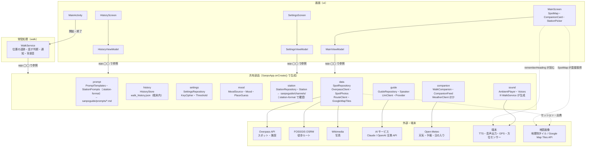
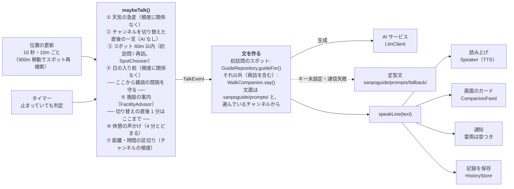
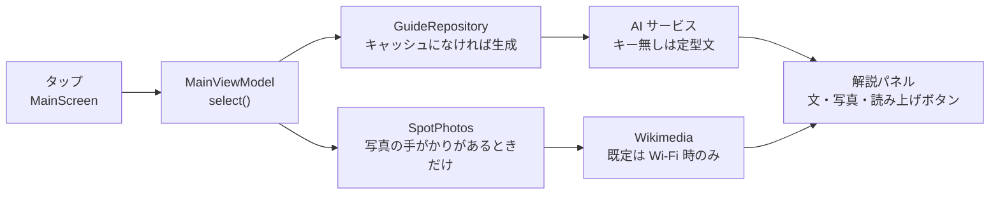
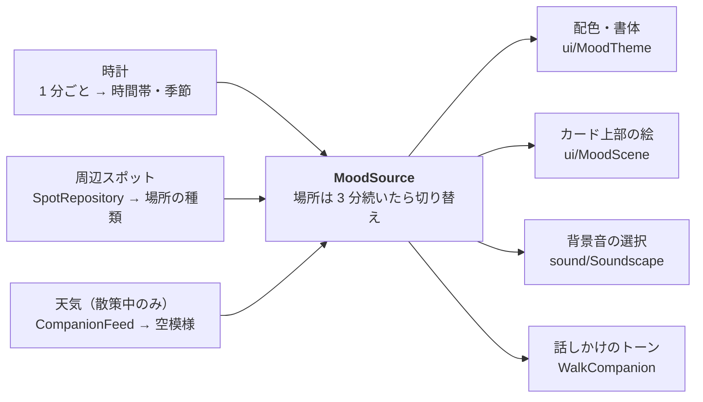
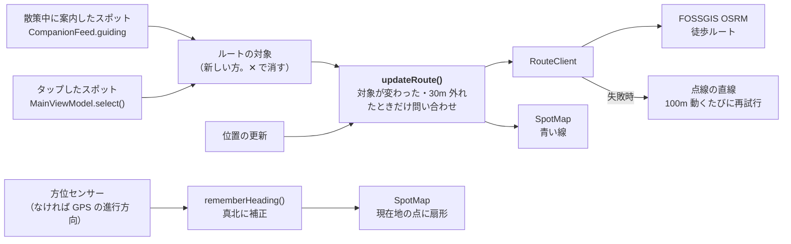
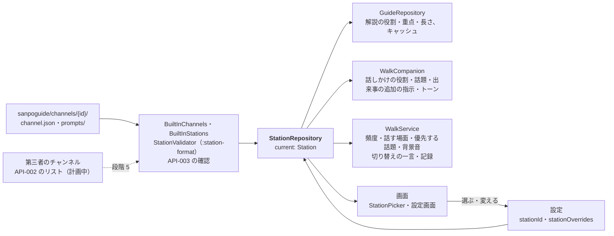

# 散策ガイドの構造図

アプリ全体を 6 枚の図で説明する。図 1 で「どこに何があるか」をつかみ、図 2〜6 で散策モードの話しかけ・スポット解説・雰囲気・地図のルートと向き・チャンネルという 5 つの流れを追う。

- ソース 60 ファイル / 約 6,980 行（アプリ 56 ファイル・6,638 行、チャンネルの形式のモジュール `:station-format` 4 ファイル・341 行）、パッケージ 11
- 画面 3（メイン・設定・記録）、常駐サービス 1（`WalkService`）、外部サービス 7（Google マップは設定で選んだときだけ）

図はコードから手で書き起こしたもの。`WalkService` の判定順を変えたり、パッケージを追加したりしたときは、この文書も更新する。

## 図 1 · 全体: 画面とサービスは、SanpoApp が持つ共有部品を使う

DI ライブラリは使っていない。`SanpoApp.onCreate()` が部品を 1 つずつ作り、画面の ViewModel と `WalkService` は `(application as SanpoApp).spots` のように直接取り出す。

`WalkService` がアプリの中心。散策モード中は画面を閉じても動き続け、位置・天気・周辺スポットと、選んでいるチャンネル（`station`）を見て「いま何を話すか」を決める。`sound` だけは SanpoApp ではなく、WalkService が必要になったときに作る。

## 図 2 · 散策モード: 話しかけるまでの流れ

位置が更新されるたびと、一定間隔のタイマーで `maybeTalk()` が呼ばれる。判定は上から順に行い、最初に当たった 1 件だけを話す。

- 順番はコードの判定順（`walk/WalkService.kt` の `maybeTalk()`）そのまま。README の表とは並びが違い、実際には「スポット」が「日の入り」より先に判定される。
- 天気と日の入りは安全に関わるため、話しかけの頻度設定を無視する。施設の案内も含め、この 3 つはチャンネルの設定で止まらない。
- スポット（初訪問・再訪）・休憩・区切り・開始・終了は、チャンネルの「話す場面」でオフにできる。頻度（`TalkLevel`）もチャンネルごと。
- チャンネルを切り替えると、次に話すのは新しいチャンネルの一言（`WalkSession.pendingGreeting`）。その後 1 分はスポット案内と休憩・区切りを控える（`WalkSession.justSwitched()`）。
- 読み上げ中は判定しない（`Speaker.isSpeaking` と `Mutex` で 1 件ずつ）。
- 記録の保存は、スポット案内・距離の区切り・散歩の終了のときに行う。区切りで話さないチャンネルでも、区切りの時点で保存だけはする。

### スポットが近くに複数あるとき

案内範囲（`ANNOUNCE_RADIUS_M` = 60m）は**ユーザーの現在地を中心にした円**で、スポットごとの範囲ではない。スポット同士の距離は判定に使わないので、「A が B の近くにある」こと自体は A の案内に影響しない。

- 1 回の判定で案内するのは 1 件だけ。`notability`（Wikipedia/Wikidata タグで +2、主要カテゴリで +1）に、チャンネルの「優先する話題」に入っている種類なら +2 を足し、高い方、同点なら近い方を選ぶ（`companion/SpotChooser.kt`）。チャンネルが除く種類は候補にしない。
- 選ばれなかったスポットは候補に残る。次の判定（30 秒ごと）で次の条件をすべて満たせば案内される。
  - 前回のスポット案内から `TalkLevel.spotGapMs` 以上経った
  - まだ 60m 以内にいる
  - 2 分以上とどまっていない（とどまっている間は周りを順に紹介しない）
  - 読み上げ中でない
- 間隔が空く前に 60m の外へ出たら、そのときは案内されない。案内済み（`talkedAbout`）にはならないので、また近づけば案内される。
- 今回の散歩で案内したスポット（同じ ID、または同じ名前で近い位置）は候補から外れる。過去の散歩で訪れたスポットは、再訪の一言の候補になる。
- スポットの通知は 1 枠（`SPOT_NOTIFICATION_ID`）を使い回すため、新しい案内が前の通知を置き換える。

## 図 3 · スポット解説: 地図でスポットをタップしたとき

解説と写真は別々に取りに行く。解説は「AI サービス・モデル・チャンネル（版を含む）・解説の長さ・スポット・位置情報を送る設定」の組み合わせでキャッシュするため、同じ条件で料金がかかるのは 1 回だけ。解説の役割・重点・長さは、選んでいるチャンネルから入る。

読み上げは自動では始まらず、パネルのボタンで `Speaker` に渡す。散策モードで初訪問のスポットに近づいたときも同じ `GuideRepository.guideFor()` を使うので、キャッシュは両方で共有される。

## 図 4 · 雰囲気: 1 つの「雰囲気」を画面・音・話し方で共有する

`MoodSource` が 3 つの入力をまとめて現在の `Mood`（時間帯 × 季節 × 空模様 × 場所）を作り、4 か所がそれを読む。

設定の「画面を雰囲気に合わせる」をオフにすると、配色・絵は雰囲気を使わなくなる。話しかけのトーンに使うかはチャンネルの設定（`mood.tone`）で決まる。背景音は、チャンネルの背景音が「自動」のときに雰囲気から選ぶ。

## 図 5 · 地図: ルートと向き

地図には、案内中のスポットまでの道と、ユーザーの向いている方向を描く。どちらも画面（`MainViewModel` と `SpotMap`）だけの処理で、`WalkService` は案内したスポットを `CompanionFeed.guiding` に出すだけ。

- ルートを取得するあいだは直線を仮に描き、地図左上のラベルに「ルートを検索中…」と出す。
- 経路サービスには現在地とスポットの緯度経度を送る。AI に位置を送るかどうかの設定（`shareLocationWithAi`）とは別で、ルート表示には常に送る。
- 方位センサーは画面が表示されている間だけ動かす。向きが 3° 以上変わったときだけ描き直す。
- 扇形の画像は 5° ごとに 1 枚作り、使い回す。

### 地図の種類

設定の「地図」（`GuideSettings.mapStyle`）で、国土地理院の 4 種類（標準・淡色・写真・標高）と Google マップの 2 種類（地図・航空写真）を選ぶ。

- 設定値は `MainViewModel.map` が `MapTiles` に変換し、`SpotMap` が osmdroid の地図画像（`ui/MapTiles.kt`）を差し替える。
- Google は利用者自身の API キーで Map Tiles API のセッションを作り（`GoogleMapTiles.session()`、2 週間有効）、地図画像の URL に付ける。
- Google の地図を表示している間は、規約に従い左下にロゴ、右下に表示範囲の出典を出す。出典は地図の移動が止まってから viewport API で取得する（`onMapViewport()`）。
- キーが未設定・無効・接続できないときは地理院の標準地図にし、理由を地図の上に出す。

### AI に送る位置情報

設定「AI に緯度経度と歩いた経路を送る」（`GuideSettings.shareLocationWithAi`、既定はオフ）をオンにしたときだけ、次を AI に送る。

| 送り先のプロンプト | 追加する値 | 作るところ |
|---|---|---|
| スポット解説（`guide/user`） | スポットの緯度経度（`coords`） | `GuidePrompt.spotVars()` |
| 話しかけ（`companion/situation`） | 現在地の緯度経度と、今回歩いた経路を最大 20 点に間引いたもの（`location`） | `WalkCompanion.situationVars()` |

解説のキャッシュは設定のオン・オフで分けている（同じスポットでも、緯度経度ありとなしで別の解説になるため）。

## 図 6 · チャンネル: 選んだチャンネルが、解説・話しかけ・話す判断を変える

チャンネル（設計は [channels.md](channels.md)、形式は [channel-package-format.md](channel-package-format.md)）は、語り手・話題・話す場面・頻度・解説の長さ・優先する話題・トーン・背景音のひとまとまり。コード上の名前は `Station`。

- 組み込みのチャンネル（標準・歴史探訪・自然観察・しずかに）は起動時に読み込み、第三者のパッケージと同じ確認（`StationValidator`）を通す。確認に通らなければ起動時に止まる（アプリ自身のファイルの誤りのため）。
- `StationRepository.current` は、選んでいるチャンネルに利用者の変更（`StationOverrides`。初期値から変えた項目だけ）を重ねたもの。変えられるのは組み込みのチャンネルだけ。
- プロンプトの `guide/system`・`companion/system` は枠で、チャンネルの文章は変数として入る（テンプレートとしては解釈されない）。最後に共通の指示 `shared/guard` が必ず付く。
- 散歩中に切り替えると、`WalkService` が `current` の変化を見て、記録に区間を足し（`WalkSession.stations`）、一言を予約する。同じチャンネルの設定を変えただけでは切り替えとみなさない。
- 天気の急変・日の入り・施設の案内は、チャンネルに項目がない（止められない）。

## パッケージ一覧

パスは `app/src/main/java/com/example/sanpoguide/` からの相対。行数は空行・コメントを含む。

| パッケージ | 役割 | 主なファイル | 行数 |
|---|---|---|---:|
| `ui` | Compose の 3 画面、地図（種類の切り替え・ルート・向きを含む）、発言カード、チャンネルの選択、雰囲気の配色と絵、ViewModel | MainScreen, SettingsScreen, SpotMap, StationPicker, MapTiles, Heading, MoodScene, MainViewModel | 2,679 |
| `data` | Overpass でのスポット・施設検索、現在地とスポットの共有状態、Wikimedia の写真、徒歩ルート、Google の地図タイルのセッションと出典 | OverpassClient, SpotRepository, SpotPhotos, RouteClient, GoogleMapTiles | 721 |
| `companion` | 散歩の友の発話、散歩中の状態（チャンネルの切り替えを含む）、画面向けの発言、天気の取得と急変判定、施設案内の判定、話題にするスポットの選択 | WalkCompanion, WalkSession, SpotChooser, FacilityAdvisor, WeatherClient | 727 |
| `sound` | 背景音の選択・その場での合成・再生 | Soundscape, Voices, AmbientPlayer | 448 |
| `walk` | 散策モードのフォアグラウンドサービス。いつ何を話すかを決める | WalkService | 456 |
| `guide` | AI サービスの抽象と実装、スポット解説とキャッシュ、TTS | GuideRepository, ClaudeClient, OpenAiCompatibleClient, Speaker | 354 |
| `settings` | 設定の保存（選んでいるチャンネルと、その変更を含む）、チャンネル導入前の設定の移行、API キーの暗号化、話しかけの頻度の段階、しきい値、地図の種類 | SettingsRepository, StationMigration, OverrideCodec, KeyCipher, TalkLevel, Threshold, MapStyle | 396 |
| `mood` | 雰囲気のモデル、場所の種類の推定、現在の雰囲気 | Mood, PlaceGuess, MoodSource | 186 |
| `history` | 散歩の記録（端末内 JSON、最新 500 件。チャンネルの区間を含む）と再訪の判定 | HistoryStore（WalkJson） | 193 |
| `prompt` | プロンプトファイルの読み込みと変数の埋め込み | PromptTemplates, Prompts | 134 |
| `station` | チャンネル（[channels.md](channels.md)）。組み込みのチャンネルの読み込み、利用者の変更の反映、プロンプトのスロットの値、画面の表示名 | Station, BuiltInStations, StationRepository, StationLabels | 244 |
| (root) | 共有部品の生成、通知チャンネルの登録 | SanpoApp | 100 |

チャンネルの形式（[API-003](channel-package-format.md)）の読み込みと確認、プロンプトのファイルと `PromptTemplates`、チャンネルのスロットからプロンプトを組み立てる `StationPrompts`、組み込みのチャンネルは、Android に依存しない別のモジュール `:station-format`（`station-format/`）にある。チャンネル管理システムの審査用の道具でも、同じ確認と同じプロンプトを使うため（GitHub Packages に `com.example.sanpoguide:station-format` として公開する）。ファイルは `station-format/src/main/resources/sanpoguide/` にあり、アプリはクラスパスから読む。

## 変更の入口: こうしたいときはここを開く

| やりたいこと | 最初に開くファイル |
|---|---|
| 話しかけ・解説の文面を変える | 枠は `station-format/src/main/resources/sanpoguide/prompts/`（一覧は [prompts.md](prompts.md)）、役割や話題はチャンネルの `sanpoguide/channels/{id}/prompts/` |
| 話す条件や優先順位を変える | `walk/WalkService.kt` の `maybeTalk()`。スポットの選び方は `companion/SpotChooser.kt` |
| 組み込みのチャンネルを追加・変更する | `station-format/src/main/resources/sanpoguide/channels/{id}/`（形式は [API-003](channel-package-format.md)）と、`BuiltInChannels.kt` の `IDS` |
| チャンネルの形式の確認を変える | `station-format/`（`StationValidator`）。形式そのものを変えるときは API-003 も |
| チャンネルの設定画面の項目を変える | `ui/SettingsScreen.kt` の `StationSettings`・`ui/SettingsViewModel.kt`、保存は `settings/SettingsRepository.kt` |
| 距離・時間・気温などの既定値を変える | `settings/Threshold.kt` |
| 話しかけの頻度の段階を変える | `settings/TalkLevel.kt` |
| 施設案内の条件を変える | `companion/FacilityAdvisor.kt` |
| AI サービスを追加する | OpenAI 互換なら `guide/Provider.kt` に 1 行。独自 API なら `LlmClient` を実装して `GuideRepository.createClient` に分岐を足す |
| 検索するスポットの種類を変える | `data/OverpassClient.kt` |
| 地図のルート表示（対象・再検索の条件）を変える | `ui/MainViewModel.kt` の `updateRoute()`。経路サービスは `data/RouteClient.kt` |
| 地図の種類を追加・変更する | `settings/MapStyle.kt`（設定の選択肢）・`ui/MapTiles.kt`（地図画像の URL と出典）。Google は `data/GoogleMapTiles.kt` |
| 地図の向きの表示を変える | `ui/Heading.kt`（向きの取得）・`ui/SpotMap.kt`（描画） |
| AI に送る位置情報を変える | `guide/GuidePrompt.kt`・`companion/WalkCompanion.kt`（設定 `shareLocationWithAi` で切り替え） |
| 配色・絵・背景音の選び方を変える | `ui/MoodTheme.kt`・`ui/MoodScene.kt`・`sound/Soundscape.kt` |
| 記録の保存形式や再訪の判定を変える | `history/HistoryStore.kt`（読み書きは `WalkJson`） |

## 計画中: 第三者のチャンネル

第三者が配信するチャンネルは、アプリとは別のチャンネル管理システムで審査・署名し、アプリは承認済みチャンネル・リストを取得する（[ADR-001](adr/ADR-001-third-party-channel-curation.md)、[API-002](channel-list-api.md)、[API-003](channel-package-format.md)、審査基準 [channel-review-policy.md](channel-review-policy.md)）。アプリ側の取り込みと素材（テキスト・画像・音声・映像）の表示はまだ実装していない（channels.md の段階 5〜7）。

## 計画中: 位置に紐づく秘密メッセージ

アプリの外にメッセージサーバーを置く予定。API の契約（[secret-messages-api.md](secret-messages-api.md)）と OpenAPI（[api/sanpo-messages.openapi.yaml](api/sanpo-messages.openapi.yaml)）はできているが、アプリ側・サーバー側ともまだ実装されていないため、上の図には入れていない。進み具合は [TODO.md](TODO.md) にある。
