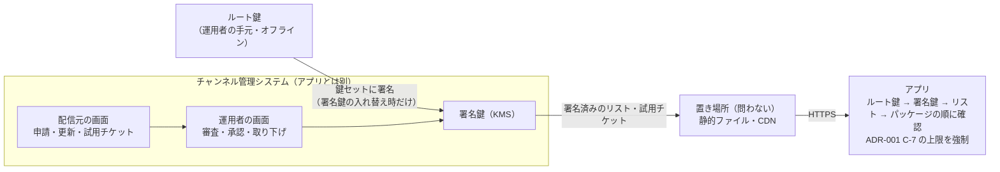
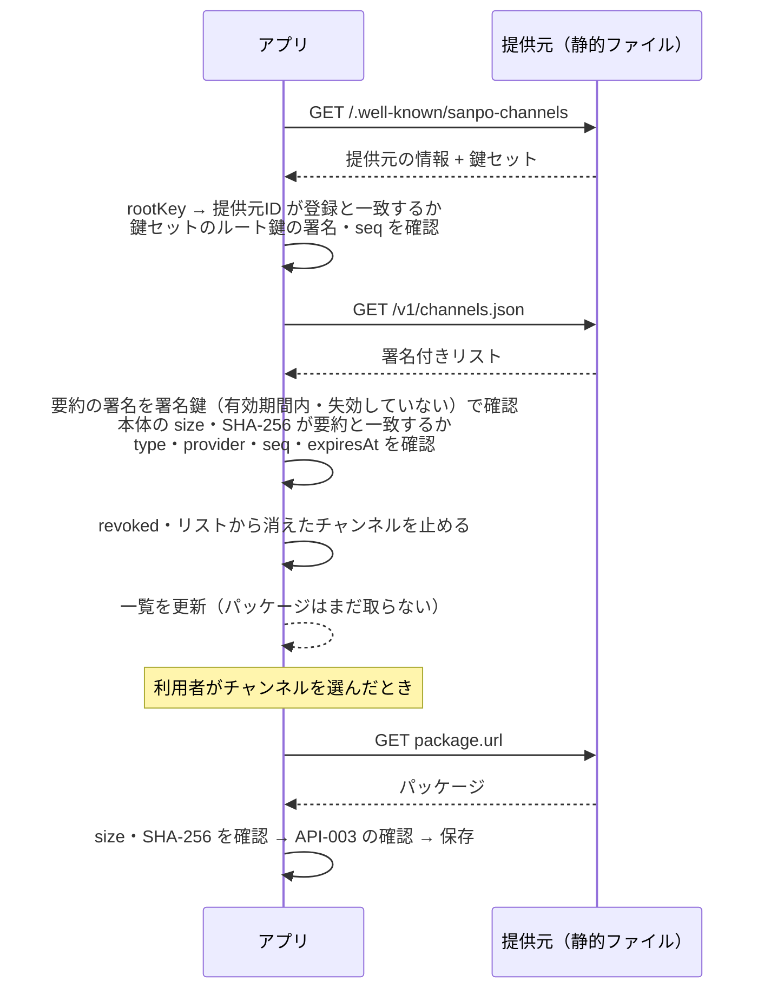

# 承認済みチャンネル・リスト 契約書

## 文書情報

| 項目 | 内容 |
|---|---|
| 文書ID | API-002 |
| ドキュメント種別 | API契約書 |
| 対象システム/機能 | SanpoGuide 第三者のチャンネルの配信（チャンネル管理システムが公開し、アプリが取得する承認済みチャンネル・リスト） |
| 関連Skill | 020_api-contract-design |
| 作成日 | 2026-10-03 |
| 作成者 | Claude（開発者との検討） |
| 承認者 | 開発者（2026-10-03） |
| ステータス | 承認済 |
| 版 | 1.1 |

## 目的・背景

[ADR-001](adr/ADR-001-third-party-channel-curation.md) で、第三者が配信するチャンネルは、システム運用者が審査し、基準を満たしたものだけ取り込むことにした。審査と公開は、アプリとは別の **チャンネル管理システム** で行う（2026-10-03 の決定）。

本書は、チャンネル管理システムとアプリの境界、つまり **アプリが取得する承認済みチャンネル・リストの形式と、アプリがそれをどう確かめて使うか** を定める。本書に準拠していれば、管理システムの実装方法と置き場所は問わない（API-001 の D-5 と同じ考え方）。

## スコープ・非スコープ

スコープ:
- 提供元（チャンネル・リストを公開する運用者）の検出と、署名の鍵
- 承認済みチャンネル・リストの形式と署名
- 取り下げ（リストからの削除と `revoked`）
- 配信元が審査前に自分の端末で試すための試用チケット
- アプリの振る舞い（取得の時期、確認の手順、失敗したときの扱い）
- アプリの設定画面での提供元の扱い

非スコープ（別途決める）:
- チャンネルのパッケージの中身（上書きできるプロンプト、設定値、上限）。**API-003（チャンネル・パッケージ形式）** として別に作る。本書では、パッケージを URL・SHA-256・大きさで指すところまでを扱う
- チャンネル管理システムの内部（配信元の申請画面、審査の画面、審査の手順、データベース）と、配信元向けの API。要件は [TODO.md「チャンネル管理システム」](TODO.md#チャンネル管理システム) で詰める
- 審査基準の中身（ADR-001 T-1）
- 組み込みのチャンネル

## 対応元ID（トレーサビリティ）

| 対応元ID | 内容 | 対応状況 |
|---|---|---|
| ADR-001 | 第三者のチャンネルは運用者の審査と署名を経たものだけ取り込む（C-1〜C-8） | 本書で取り込みの形式を定める |
| API-001 | アカウントID（`sg1…`）の作り方、Ed25519、D-5 | 流用 |

## 方針・決定事項

### 決定事項（2026-10-03、開発者の回答）

| No. | 論点 | 決定 |
|---|---|---|
| L-1 | チャンネル管理システムの利用者 | 運用者と配信元。配信元は申請・更新・審査状況の確認、運用者は審査・承認・取り下げを行う |
| L-2 | アプリの取り込み経路 | 通常は承認済みチャンネル・リストだけ。加えて、配信元が審査前に自分の端末で試せる試用チケット（開発者モードのときだけ、QR コードで読み込む） |
| L-3 | リストへの署名 | 管理システムの中で、承認したときに自動で署名する。秘密鍵はクラウドの鍵管理サービス（KMS）に置く |
| L-4 | リストの取得先 | 設定で変えられる。既定はアプリに内蔵した提供元。ほかの提供元は、設定で URL と鍵の指紋を足して使う |
| L-5 | 内蔵の提供元の運営者 | 当面は開発者本人（ADR-001 C-10） |

### 決定事項（2026-10-03、段階7・13）

Claude の提案を開発者が承認した。

| No. | 論点 | 決定 |
|---|---|---|
| P-1 | 鍵の持ち方 | 2 段にする。**ルート鍵**（運用者の手元でオフラインに保管）が **署名鍵**（KMS に置き、管理システムが使う）に署名する。アプリが信用するのはルート鍵だけ。署名鍵は有効期限付きで、ルート鍵で入れ替え・失効できる。L-3 で管理システムが乗っ取られても、ルート鍵で署名鍵を失効させれば、アプリを更新せずに立て直せる |
| P-2 | 提供元の識別 | 提供元ID = `sc1` + ルート鍵の公開鍵の SHA-256 を base32（小文字、パディングなし）にした先頭 32 文字。API-001 のアカウントIDと同じ作り方で、ID がそのまま鍵の指紋になる |
| P-3 | 署名の形式 | 署名する JSON は base64url にした `payload` に入れ、そのバイト列に Ed25519 で署名する（JSON の正規化が要らない）。API-001 の封筒と同じ考え方 |
| P-4 | パッケージの確かめ方 | リストに各パッケージの SHA-256 を載せ、リストに署名する。パッケージごとの運用者の署名は要らない（ADR-001 の C-2 を置き換える） |
| P-5 | 取り下げ | リストに載っていないチャンネルは使わない。とくに問題があって止めたものは `revoked` に理由とともに載せ、パッケージを端末から消す。別の失効リストは作らない（ADR-001 の C-6 を置き換える） |
| P-6 | 古いリストへの差し戻し | リストに通し番号（`seq`）と有効期限（`expiresAt`）を付ける。アプリは、前に受け取ったものより小さい `seq` を拒む。期限が切れたリストの提供元のチャンネルは、次の散歩から使わない（散歩の途中では止めない） |
| P-7 | 管理システムとの関係 | アプリが信用するのは署名であって、管理システムではない。リストとパッケージは静的ファイルとして CDN などに置いてよい。管理システムが止まっても、アプリは期限までは前回のリストで動く |

### 決定事項（2026-10-03、管理システムの検討。版 1.1）

管理システムを AWS（KMS）で作る検討の中で、開発者が決めた。

| No. | 論点 | 決定 |
|---|---|---|
| P-8 | リストの署名の形（P-3 の補足） | リストは、本体に直接署名せず、本体の SHA-256 を含む小さな**要約**（`channel-list-digest`）に署名する。AWS KMS の Ed25519 は一度に 4,096 バイトまでしか署名できず、リスト（最大 1MB）に直接署名できないため。要約は通常の Ed25519 で署名するので、アプリは API-001 と同じ Tink だけで確かめられる。鍵セット・試用チケットは小さいので、P-3 の形のまま。どの文書がどちらの形かは `type` で固定し、文書の側から選べないようにする |
| P-9 | 配信元の鍵の移し替え | 配信元が鍵をなくした・漏れたときは、運用者が本人確認のうえで、チャンネルを別の鍵（別のアカウントID）に移せる（ADR-001 C-11）。移したことはリストの `publisherChange` で示す。アプリは運用者が署名したリストを正とし、移し替えを受け入れて利用者に一度知らせる |

### 全体の構成



## エンドポイント一覧

すべて HTTPS の GET で、静的ファイルとして置ける。`{base}` は提供元の URL。

| メソッド | パス | 概要 |
|---|---|---|
| GET | `{base}/.well-known/sanpo-channels` | 提供元の情報と、ルート鍵が署名した鍵セット |
| GET | `{base}/v1/channels.json`（パスは検出の `list` で指定） | 承認済みチャンネル・リスト（署名鍵が署名） |
| GET | リストの `package.url` | チャンネルのパッケージ（形式は API-003） |
| GET | リストの `icon.url` | チャンネルのアイコン（PNG、256×256 以下） |

パッケージとアイコンは別のドメインに置いてもよい。HTTPS であること、SHA-256 が合うことだけを確かめる。

## リクエスト・レスポンス仕様

共通の決まり:
- 文字コードは UTF-8、日時は ISO 8601（タイムゾーン付き）
- 知らない項目は無視する。項目の追加は互換性のある変更として扱う
- 署名付きの文書は次の形にする（P-3）

```json
{
  "payload": "<base64url(署名する JSON のバイト列)>",
  "keyId": "<署名した鍵の ID。ルート鍵なら提供元ID>",
  "sig": "<base64url(payload のバイト列への Ed25519 署名)>"
}
```

`payload` の中の JSON には必ず `type` を入れ、ほかの種類の文書に流用されないようにする（`keyset` / `channel-list` / `channel-list-digest` / `test-ticket`）。

リストだけは、要約に署名する次の形にする（P-8）。`payload` はリスト本体で、署名は `digest` の中にある。

```json
{
  "payload": "<base64url(リスト本体の JSON のバイト列)>",
  "digest": {
    "payload": "<base64url(要約の JSON のバイト列)>",
    "keyId": "<署名鍵の ID>",
    "sig": "<base64url(要約の payload のバイト列への Ed25519 署名)>"
  }
}
```

要約の `payload` の中身:

```json
{
  "type": "channel-list-digest",
  "provider": "sc1abcd...",
  "seq": 128,
  "issuedAt": "2026-10-03T03:00:00Z",
  "expiresAt": "2026-10-10T03:00:00Z",
  "sha256": "<リスト本体の payload をデコードしたバイト列の SHA-256 の hex>",
  "size": 4821
}
```

アプリは次の順に確かめる。どれかが合わなければ `bad_signature` でリストを捨てる。

1. 要約の署名を、鍵セットの署名鍵で確かめる（`keyId`・有効期間・失効は鍵セットの文書と同じ）。`type` が `channel-list-digest` であること
2. 本体の `payload` をデコードしたバイト列の大きさと SHA-256 が、要約の `size`・`sha256` と一致すること
3. 本体の `type` が `channel-list` で、`provider`・`seq`・`issuedAt`・`expiresAt` が要約と一致すること。`seq` の巻き戻し（`rollback`）と期限（`expired`）は、この値で判定する

### GET /.well-known/sanpo-channels

```json
{
  "provider": "sc1abcd...",
  "name": "SanpoGuide 公式チャンネル",
  "versions": ["v1"],
  "list": "/v1/channels.json",
  "rootKey": "<base64url(ルート鍵の公開鍵 32 バイト)>",
  "keyset": { "payload": "...", "keyId": "sc1abcd...", "sig": "..." },
  "reviewPolicyUrl": "https://example.com/channels/review-policy",
  "termsUrl": "https://example.com/channels/terms",
  "contact": "channels@example.com"
}
```

`keyset` の `payload` の中身（ルート鍵が署名）:

```json
{
  "type": "keyset",
  "provider": "sc1abcd...",
  "seq": 3,
  "issuedAt": "2026-10-03T00:00:00Z",
  "keys": [
    { "keyId": "k-2026-10", "publicKey": "<base64url>", "notBefore": "2026-10-01T00:00:00Z", "notAfter": "2027-04-01T00:00:00Z" }
  ],
  "revokedKeys": ["k-2026-04"]
}
```

- アプリは `rootKey` から提供元IDを計算し、設定に登録した提供元ID（内蔵、または利用者が足したもの）と一致することを確かめる。一致しなければ使わない
- `keys` の有効期間は 1 年以内。`seq` は鍵セットを作り直すたびに増やし、アプリは小さい `seq` を拒む
- 署名鍵の失効は `revokedKeys` に載せる。失効した鍵で署名されたリストは、署名した日時にかかわらず使わない

### GET /v1/channels.json

リスト本体の `payload` の中身（署名鍵が要約に署名する。P-8）:

```json
{
  "type": "channel-list",
  "format": 1,
  "provider": "sc1abcd...",
  "seq": 128,
  "issuedAt": "2026-10-03T03:00:00Z",
  "expiresAt": "2026-10-10T03:00:00Z",
  "channels": [
    {
      "id": "kamakura-history",
      "version": 3,
      "publisher": "sg1wxyz...",
      "publisherName": "鎌倉歴史散歩の会",
      "publisherChange": { "from": "sg1oldk...", "at": "2026-10-02T09:00:00Z", "reason": "配信元の鍵の紛失" },
      "name": "鎌倉歴史散歩",
      "summary": "鎌倉の寺社と武士の歴史を、語り部の口調で",
      "description": "…",
      "lang": ["ja"],
      "tags": ["history", "temple"],
      "regions": ["xn7"],
      "icon": { "url": "https://cdn.example.com/icons/kamakura-history-3.png", "sha256": "<hex>" },
      "package": { "url": "https://cdn.example.com/pkg/kamakura-history-3.zip", "sha256": "<hex>", "size": 18342, "format": 1 },
      "minAppVersion": 12,
      "approvedAt": "2026-10-02T09:00:00Z"
    }
  ],
  "revoked": [
    { "id": "old-channel", "versions": [1, 2], "reason": "審査基準に反する内容が見つかったため", "revokedAt": "2026-10-01T00:00:00Z" }
  ]
}
```

| 項目 | 型 | 内容 |
|---|---|---|
| `format` | int | リストの形式の版。本書は 1 |
| `seq` | int | 公開するたびに 1 以上増やす |
| `expiresAt` | string | `issuedAt` から 14 日以内。管理システムは、内容が変わらなくても期限が切れる前に作り直して公開する |
| `channels[].id` | string | 提供元の中で一意。英小文字・数字・`-`、3〜40 文字。アプリの中では「提供元ID＋id」で区別する |
| `channels[].version` | int | 審査を通るたびに増える。リストに載せるのは各チャンネルの最新の承認済みの版 1 つだけ |
| `channels[].publisher` | string | 配信元のアカウントID（API-001 と同じ鍵）。ADR-001 C-4 のとおり、パッケージには配信元の署名も付く（形式は API-003） |
| `channels[].publisherChange` | object? | 運用者が配信元の鍵を移し替えた（P-9・ADR-001 C-11）ときだけ付ける。`from` は前のアカウントID、`at` は移し替えた日時、`reason` は利用者に見せる理由。移し替え後の最初の版から、少なくとも 90 日は載せ続ける |
| `channels[].regions` | string[]? | 地域に限ったチャンネルの geohash の接頭辞。省略するとどこでも使える。アプリは一覧の並び順に使うだけで、地域の外でも使える |
| `channels[].package.format` | int | パッケージの形式の版（API-003）。アプリが知らない版のチャンネルは一覧に出さない |
| `channels[].minAppVersion` | int | 必要なアプリの versionCode。満たさなければ一覧に「アプリの更新が必要」と出す |
| `revoked[]` | object[] | 問題があって止めたチャンネル。`versions` を省略するとすべての版 |

大きさの上限: リストは 1MB、パッケージは 2MB、アイコンは 100KB。超えたら取得を打ち切る。

### 試用チケット（QR コード）

配信元が、審査の前に自分の端末でチャンネルを試すためのもの（L-2）。管理システムが配信元の求めに応じて発行し、署名鍵で署名する。

```json
{
  "type": "test-ticket",
  "provider": "sc1abcd...",
  "channel": "kamakura-history",
  "publisher": "sg1wxyz...",
  "package": { "url": "https://...", "sha256": "<hex>", "size": 18342, "format": 1 },
  "issuedAt": "2026-10-03T03:00:00Z",
  "expiresAt": "2026-10-10T03:00:00Z"
}
```

- QR コードには、署名付き文書の形（`payload`・`keyId`・`sig`）をそのまま入れる。鍵セットは提供元から取得して確かめる
- アプリは開発者モードのときだけ読み込む。有効期限は 7 日以内
- 試用中のチャンネルには、画面と最初の話しかけで「審査前の試用」と示す。ほかの人に共有する機能はない
- 審査前でも ADR-001 C-7（安全の案内、共通ルール、上限）は同じに強制する

## 呼び出しシーケンス

### リストを取得して、チャンネルを使えるようにする



### アプリの振る舞い

| 場面 | 振る舞い |
|---|---|
| 取得の時期 | アプリの起動時と散歩の開始時に、前回の取得から 24 時間以上たっていれば取得する。設定画面から手動でも取得できる。散歩中は取得しない |
| パッケージの取得 | 利用者がチャンネルを使うと決めたときだけ取得する。使っているチャンネルに新しい版が出たら、次の取得時（Wi-Fi のときだけ、が既定）に取得し、確認できてから古い版と入れ替える |
| 確認に失敗したとき | そのリストは捨て、前回のリストを使い続ける（期限まで）。理由を設定画面の提供元の欄に出す |
| リストの期限が切れたとき | その提供元のチャンネルは、次の散歩から使わない（散歩の途中では止めない）。使っていたら標準のチャンネルに戻し、理由を知らせる |
| 取り下げ | `revoked` に載った、またはリストから消えたチャンネルは使わない。`revoked` に載ったものはパッケージを消し、理由を知らせる。散歩中に分かったら（散歩の開始時の取得で）その時点で標準に戻す |
| 位置情報 | 取得の要求に位置情報を含めない。`regions` による並べ替えは端末で行う |
| 配信元の鍵の移し替え | 使っているチャンネルの `publisher` が、保存しているパッケージの配信元と違うとき、`publisherChange.from` が保存している配信元と一致すれば受け入れ、新しい版を取得して、理由とともに一度知らせる。一致しない（`publisherChange` がない、`from` が違う）ときは、その版を使わず `publisher_changed` として前の版を使い続ける（P-9） |

### 設定画面の提供元

- 「チャンネルの提供元」の欄に、内蔵の提供元（名前・提供元ID）を表示する。オフにもできる
- ほかの提供元は、QR コード（`sanpo-channels:` + URL + 提供元ID）を読み込むか、URL と提供元IDを入力して足す。足すときは「この提供元が審査したチャンネルを信用することになる」と表示する
- 提供元IDは URL から自動で取らない。サーバーが返す鍵を、利用者が別の経路で得た提供元IDと照合するため（API-001 の公開鍵の照合と同じ考え方）
- HTTPS 必須。デバッグビルドに限り `http://localhost` と `http://10.0.2.2` を許可する

## エラー表

静的ファイルなので、HTTP のエラー（404・5xx・タイムアウト）は「取得できなかった」として扱う。以下は、アプリが内容を確かめて拒むときの理由（設定画面とログに出す）。

| エラーコード | 発生条件 | アプリの扱い |
|---|---|---|
| `fetch_failed` | 取得できない（HTTP のエラー、タイムアウト、TLS の失敗） | 前回のリストを使い続ける（期限まで） |
| `provider_mismatch` | `rootKey` から計算した提供元IDが登録と違う | その提供元を使わない。利用者に知らせる |
| `unsupported_version` | `versions` に `v1` がない、または `format` を知らない | 前回のリストを使い続ける。アプリの更新を促す |
| `bad_signature` | 署名が合わない、`type` が違う、`payload` が読めない | その文書を捨てる |
| `unknown_key` | `keyId` が鍵セットにない | その文書を捨てる |
| `key_not_valid` | 署名鍵が有効期間外、または `revokedKeys` に載っている | その文書を捨てる |
| `rollback` | `seq` が前回より小さい。または同じ `seq` で中身が違う | その文書を捨てる |
| `expired` | `expiresAt` を過ぎている。または `expiresAt` が `issuedAt` から 14 日を超える | その文書を捨てる |
| `too_large` | 大きさの上限を超えた | 取得を打ち切る |
| `hash_mismatch` | パッケージ・アイコンの SHA-256 か大きさがリストと違う | そのファイルを捨てる。古い版があれば使い続ける |
| `package_rejected` | パッケージの中身の確認（API-003）に失敗した | そのチャンネルを使わない |
| `publisher_changed` | 使っているチャンネルの配信元が、`publisherChange` の裏付けなく変わった | その版を使わない。前の版を使い続ける |
| `ticket_invalid` | 試用チケットの署名・期限・開発者モードの条件を満たさない | 読み込まない |

端末の時計がずれていると期限の判定を誤るため、`issuedAt` が端末の時刻より 1 日以上先なら時計のずれを疑い、`expired` ではなく前回のリストを使い続ける。

## 確認観点

提供元が本書に準拠しているか、アプリが正しく拒むかを確かめる観点。準拠テストにする。

| No. | 観点 |
|---|---|
| V-01 | `/.well-known/sanpo-channels` の `rootKey` から計算した提供元IDが `provider` と一致する |
| V-02 | 鍵セットがルート鍵で正しく署名され、`type` が `keyset` |
| V-03 | リストの要約が有効期間内の署名鍵で正しく署名され、`type` が `channel-list-digest`。本体の大きさ・SHA-256・`provider`・`seq`・`issuedAt`・`expiresAt` が要約と一致し、本体の `type` が `channel-list`（P-8） |
| V-04 | リストの `expiresAt` が `issuedAt` から 14 日以内で、まだ切れていない |
| V-05 | `seq` が前回の取得より小さくない |
| V-06 | `channels[].id` が提供元の中で一意で、書式どおり |
| V-07 | 各パッケージ・アイコンを取得でき、SHA-256 と大きさがリストと一致する |
| V-08 | 大きさの上限を守っている |
| V-09 | すべての URL が HTTPS |
| V-10 | アプリ: 署名の改ざん、知らない鍵、失効した鍵、期限切れ、`seq` の巻き戻し、ハッシュの不一致を、それぞれ正しいエラーコードで拒む |
| V-11 | アプリ: 確認に失敗したとき、前回のリストで動き続ける |
| V-12 | アプリ: `revoked` とリストからの削除で、チャンネルが止まる（散歩中は開始時の取得で標準に戻る） |
| V-13 | アプリ: 試用チケットは開発者モードでだけ読み込め、期限が切れたら使えない |
| V-14 | アプリ: 取得の要求に位置情報が含まれない |
| V-15 | 要約の `payload` が 4,096 バイト未満（KMS で署名できる大きさ） |
| V-16 | `publisherChange` があるとき、`from` が書式どおりで `publisher` と違う |
| V-17 | アプリ: 要約と本体の不一致（本体の差し替え、`seq` の食い違い）を `bad_signature` で拒む |
| V-18 | アプリ: `publisherChange` の裏付けがある配信元の変更は受け入れて知らせ、裏付けのない変更は `publisher_changed` で拒む |

## 互換性方針・移行メモ

- 版は 2 つの場所で分ける。提供元全体の版は検出の `versions`（`v1`）、リストの形式の版は `format`、パッケージの形式の版は `package.format`
- 項目の追加は互換性のある変更。知らない項目は無視する
- 互換性のない変更は `format` を上げる。提供元は移行期間中、古い形式のリストも別のパスで公開し、検出の `versions` に両方を載せる
- パッケージの形式を上げるときは、新旧両方の形式のパッケージを用意できないチャンネルは古いアプリの一覧に出なくなる（`minAppVersion` で案内する）
- ルート鍵の入れ替えは提供元IDが変わる（＝別の提供元になる）。内蔵の提供元のルート鍵を入れ替えるにはアプリの更新が要る。ルート鍵は失わないよう、複数の場所にオフラインで保管する
- 新規の契約のため、既存の利用者への影響はない
- 1.1 の P-8（要約への署名）は、リストの形を変えるが `format` は上げない。1.0 を実装した提供元・アプリがまだないため

## 制約

- 審査済みであることは署名で確かめられるが、審査の質そのものは提供元を信用するしかない。内蔵以外の提供元を足すかどうかは利用者の判断になる
- 署名鍵が KMS にあるため（L-3）、管理システムが乗っ取られると、署名鍵が失効するまで偽のリストを出せる。失効にはルート鍵での鍵セットの作り直しが要り、アプリに届くまで最大 24 時間（取得の間隔）かかる
- リストの期限（最大 14 日）の間は、取り下げがアプリに届かない端末がある（ずっとオフラインの端末）
- 端末の時計を大きくずらされると、期限の判定は守れない

## 未決事項・リスク

| No. | 内容 | 決める時期 |
|---|---|---|
| 1 | ~~方針 P-1〜P-7 の採否~~ → 解決（2026-10-03、すべて採用） | — |
| 2 | ~~内蔵の提供元を誰が運営するか~~ → 解決（2026-10-03、L-5） | — |
| 3 | 宣伝を目的としたチャンネルを示す項目（例: `sponsored`）を入れるか（ADR-001 の未決事項 No.2） | 審査基準（ADR-001 T-1）と同時 |
| 4 | リストの `expiresAt` の上限（14 日）と、取得の間隔（24 時間）が妥当か | 管理システムの運用を決めるとき |
| 5 | パッケージの形式（API-003）。とくに配信元の署名の付け方 | 次の作業 |
| 6 | ~~リストの JSON Schema と、任意の提供元に対して流せる準拠テスト~~ → 置き場所を決定（2026-10-03）。管理システムのリポジトリ（sanpo-channel-console）に置く。中身は実装着手時 | — |

## 関連ドキュメント・参照リンク

- [ADR-001](adr/ADR-001-third-party-channel-curation.md): 第三者のチャンネルは運用者の審査と署名を経たものだけ取り込む
- [secret-messages-api.md（API-001）](secret-messages-api.md): アカウントID、Ed25519、D-5
- [TODO.md「チャンネル」「チャンネル管理システム」](TODO.md#チャンネル)
- 検討の記録: [skill-logs/api_contract_design_2026-10-03.md](skill-logs/api_contract_design_2026-10-03.md)

## 変更履歴

| 日付 | 版 | 変更内容 | 変更者 |
|---|---|---|---|
| 2026-10-03 | 0.1 | 草案 | Claude |
| 2026-10-03 | 1.0 | L-5 を追加。P-1〜P-7 を決定事項にして承認 | Claude（承認: 開発者） |
| 2026-10-03 | 1.1 | P-8（リストは要約に署名。AWS KMS の 4,096 バイトの制限のため）、P-9（配信元の鍵の移し替えと `publisherChange`）を追加。V-03 を改め、V-15〜V-18 とエラー `publisher_changed` を追加。未決事項 No.6 の置き場所を決定 | Claude（承認: 開発者） |
