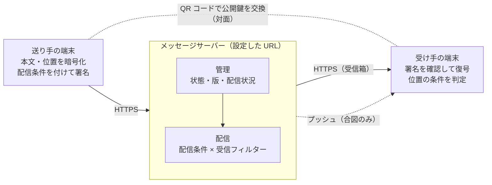
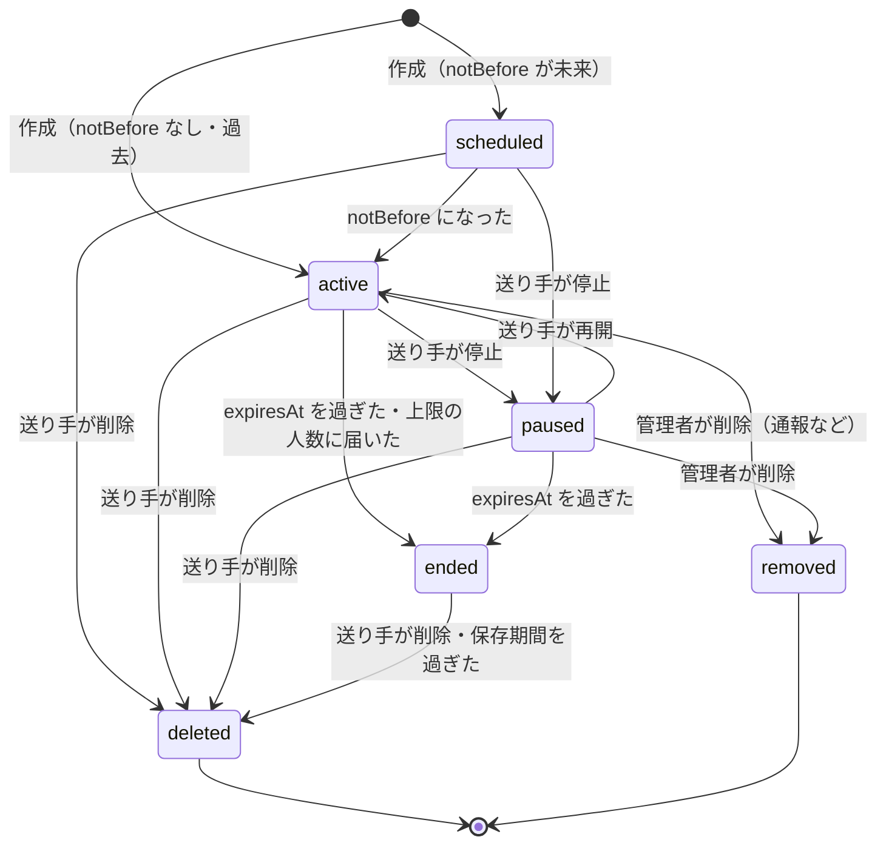
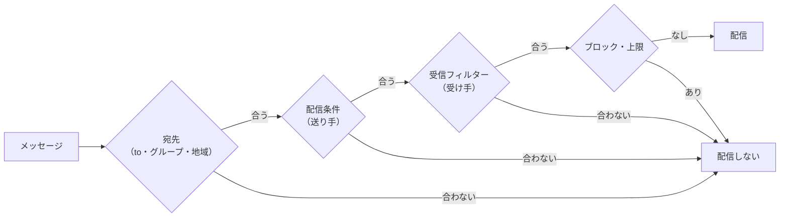
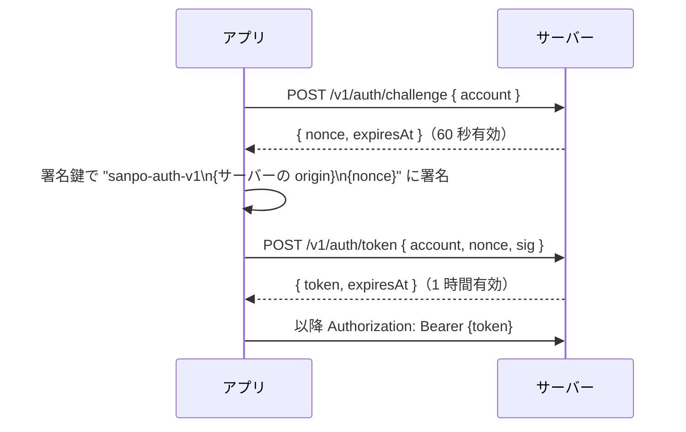
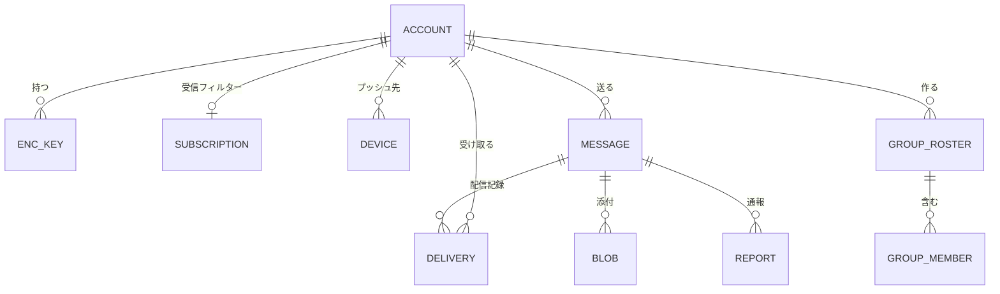
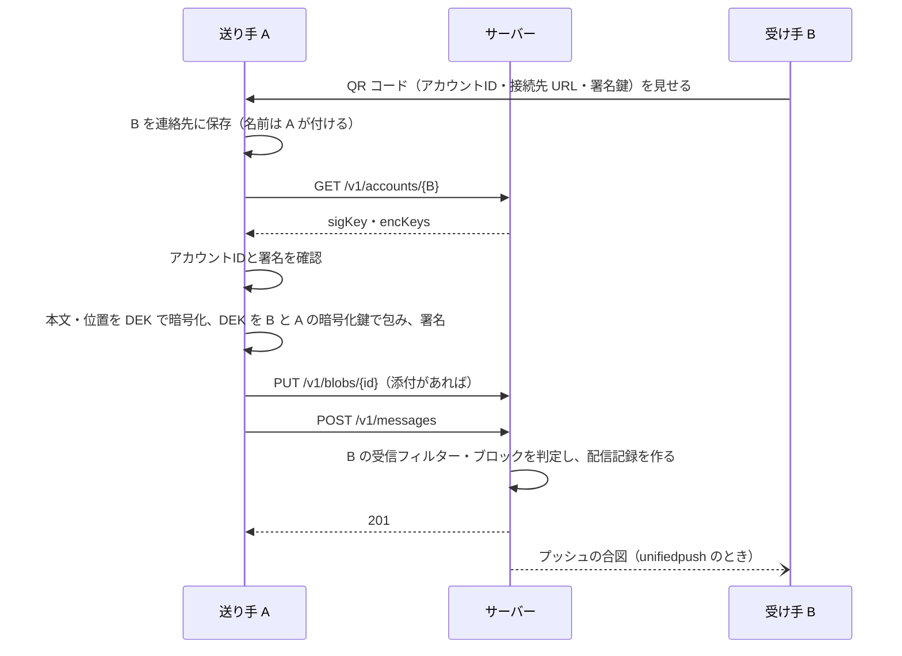
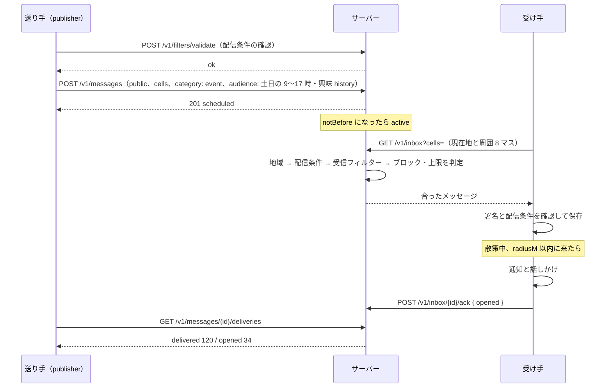
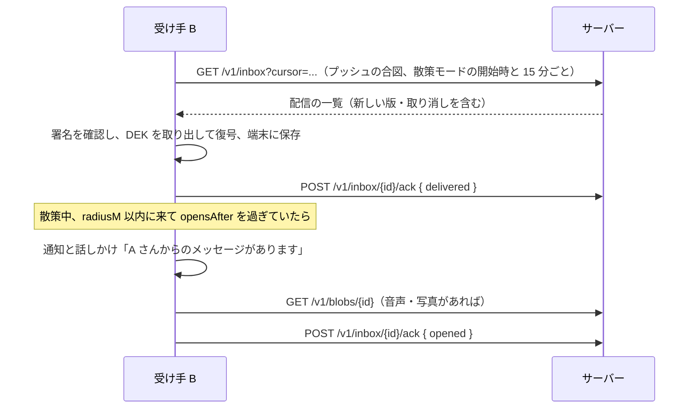

# 秘密メッセージ サーバー API 契約書（案）

## 文書情報

| 項目 | 内容 |
|---|---|
| 文書ID | API-001 |
| ドキュメント種別 | API契約書 |
| 対象システム/機能 | SanpoGuide 位置に紐づく秘密メッセージ（他人宛て・グループ・公開）の管理と配信 |
| 関連Skill | 020_api-contract-design |
| 作成日 | 2026-09-29 |
| 作成者 | Claude（開発者との検討） |
| 承認者 | 開発者（2026-09-29） |
| ステータス | 承認済 |
| 版 | 1.0 |

## 目的・背景

[TODO.md「位置に紐づく秘密メッセージ」](TODO.md#位置に紐づく秘密メッセージ)のうち、他人宛て・公開のメッセージにはサーバーが必要になる。一方で、アプリは「位置情報をむやみに外部へ送らない」方針をとっている。そこで次の 4 点を満たす API を定める。

1. **接続先を URL で設定できる**: 特定の事業者のサーバーに縛らない。自分や家族で立てたサーバーにもつなげる（AI サービスの「カスタム」と同じ考え方）
2. **サーバーを信用しなくてよい**: 本文と正確な位置は端末で暗号化する（エンドツーエンド暗号化）。サーバーは本文を読まずに管理・配信する
3. **パスワードもメールアドレスも持たない**: 利用者は端末で作った公開鍵・秘密鍵の組で識別する。認証は秘密鍵による署名で行う
4. **サーバーでメッセージを管理し、フィルターを使って配信する**: 送り手は置いたメッセージの状態（予約・配信中・停止・終了）と配信状況を管理できる。配信先は、送り手が決める条件（配信条件）と受け手が決める条件（受信フィルター）の両方で絞り込む

## スコープ・非スコープ

スコープ:
- 接続先の検出（`/.well-known`）、認証、アカウント（公開鍵の登録）
- メッセージの管理: 作成・更新・停止・再開・削除、状態と配信状況の確認
- 配信: 受信箱の取得、配信条件と受信フィルターによる絞り込み、配信の記録（届いた・開けた）、プッシュ通知の合図
- グループ、添付ファイル、通報、管理者の操作
- 暗号方式（鍵の種類、メッセージの封筒の形式）
- アプリの設定画面での接続先 URL の扱い

非スコープ（別途決める）:
- サーバーの実装方法と置き場所。本書に準拠していれば問わない（D-5、[サーバーの準拠要件](#サーバーの準拠要件)）
- 自分宛てメッセージ。サーバーを使わず端末内で完結させる（TODO のとおり）
- 管理者用の Web 画面（API は本書に含めるが、画面は別途）
- 広告の課金・精算

## 対応元ID（トレーサビリティ）

| 対応元ID | 内容 | 対応状況 |
|---|---|---|
| 該当なし | TODO.md「位置に紐づく秘密メッセージ」「第三者の媒体・広告の再生」「共通の検討事項（サーバーの要否・プライバシー）」 | 本書で対応 |

## 方針・決定事項

### 決定事項（2026-09-29、段階7・13）

| No. | 論点 | 決定 |
|---|---|---|
| D-1 | 最初の版（第 1 版）に含める範囲 | `direct`・`group`、受信フィルター、メッセージの管理（状態・版・配信状況）を第 1 版にする。`public`・配信条件（`audience`・`delivery`）・`publisher`・運営 API は第 2 版にする |
| D-2 | 認証方式 | チャレンジへの署名と引き換えに短期トークンを受け取る方式（[認証](#認証)） |
| D-3 | プッシュ | `poll`（定期的に取得）と `unifiedpush` の 2 つだけ。中継サーバー（FCM）は運営しない |
| D-4 | 配信条件に使える受け手の情報 | 言語（`recipient.lang`）と興味（`recipient.interests`）だけ |
| D-5 | サーバーの実装方法と置き場所 | 本書のインターフェースに準拠していれば、実装方法（言語・フレームワーク・データベース）も置き場所（クラウド・自宅・社内）も問わない。アプリは接続先 URL の設定だけでサーバーを選ぶ。公式サーバーは前提にしない |

第 2 版の機能も、本書では契約の形まで決めておく（第 1 版の実装が第 2 版の妨げにならないようにするため）。第 2 版は `/v1` のまま項目とエンドポイントを足す形で出し、どちらの版かは検出 API の `features` で知らせる（[互換性方針](#互換性方針移行メモ)）。以下、第 2 版の機能には **［第 2 版］** と記す。

| 機能 | 第 1 版 | 第 2 版 |
|---|---|---|
| `direct`・`group` の送受信 | ○ | ○ |
| メッセージの管理（状態・版・配信状況） | ○ | ○ |
| 受信フィルター・ブロック・静かな時間帯 | ○ | ○ |
| プッシュ（`poll`・`unifiedpush`） | ○ | ○ |
| 添付ファイル・通報 | ○ | ○ |
| `public`（公開メッセージ）と地域での取得 | | ○ |
| 配信条件（`audience`）・配信の上限（`delivery`）・公開プロフィール | | ○ |
| `publisher` の役割、`event`・`notice`・`promo` | | ○ |
| 運営 API（`/v1/admin/...`） | | ○（第 1 版では、通報はサーバーの管理者が直接データを見て対応する） |

### 全体の構成



- サーバーは本文・正確な位置・添付の中身を読めない。管理と配信には、封筒のヘッダー（誰から・誰へ・種類・タグ・大まかな地域・期間・配信条件）だけを使う
- 「その場所に来たら開ける」の最終判定は受け手の端末が行う。サーバーの配信は「どの端末に届けるか」まで
- 公開鍵の交換は、対面で QR コードを読み合うのが基本。サーバーは公開鍵の置き場所にもなるが、サーバーが返す鍵は QR コードで得た指紋と照合してから使う（サーバーによる鍵のすり替えを防ぐ）

### サーバーが読める情報と読めない情報

フィルターで配信するには、サーバーが条件を読める必要がある。そこで情報を次のように分ける。

| 区分 | 例 | 置き場所 |
|---|---|---|
| サーバーが読める（配信に使う） | 送り手、受け手・グループ、種類（`category`）、タグ、言語、大まかな地域（geohash）、期間、配信条件 | 封筒の `protected`（署名付き。サーバーは読めるが書き換えられない） |
| サーバーが読めない | 本文、正確な位置と半径、開ける日時、合言葉のヒント、添付の中身 | 封筒の `ciphertext` |

配信条件もヘッダーに入れて送り手が署名するため、サーバーが勝手に配信先を広げることはできない（受け手の端末で検証できる）。ただし「条件に合う人に確実に届けたか」はサーバーを信用するしかない。

### 鍵（端末ごとに作る）

| 鍵 | 方式 | 用途 |
|---|---|---|
| 署名鍵 | Ed25519 | アカウントの識別、サーバーへの認証、メッセージ・グループの名簿への署名、暗号化鍵への署名 |
| 暗号化鍵 | X25519（HPKE） | 自分宛てのメッセージの鍵を受け取る |

- **アカウントID** = `sg1` + 署名鍵の公開鍵の SHA-256 を base32（小文字、パディングなし）にした先頭 32 文字。公開鍵から計算できるため、ID そのものが鍵の指紋になる
- 暗号化鍵の公開鍵には署名鍵で署名を付けて公開する。受け手は、アカウントIDから署名鍵をたどって暗号化鍵を確認できる
- 秘密鍵は Tink のキーセットとして保存し、キーセット自体を Android Keystore の AES 鍵で暗号化する（`KeyCipher` と同じ仕組み）。Keystore だけに閉じ込めない理由は、X25519 と Ed25519 を Keystore が扱えるのは Android 12・13 以降で、minSdk 26 では使えないため。また、機種変更時のバックアップ（合言葉で暗号化して書き出す）も可能になる
- 同じ鍵をどのサーバーでも使う。接続先を変えてもアカウントIDは変わらない

### 暗号方式 `sanpo-v1`

- 本文: メッセージごとにランダムな 256 ビットの鍵（以下 DEK）を作り、AES-256-GCM で暗号化する。AAD は下記の `protected`
- DEK の受け渡し（`direct`・`group`）: 受け手ごとに HPKE（Base モード、DHKEM(X25519, HKDF-SHA256)、HKDF-SHA256、AES-256-GCM）で包む。`info` = `sanpo-v1 dek`、`aad` = メッセージID。送り手も受け手に含め、自分が送ったものを後から読めるようにする
- 公開メッセージ（`public`）: 受け手を限定しないため、ヘッダーの `enc` で次のどちらかを選ぶ
  - `place`: DEK を場所（と任意の合言葉）から導出する。`DEK = HKDF-SHA256(ikm = 合言葉（なければ空）, salt = メッセージID, info = "sanpo-v1 place " + geohash8)`。geohash8 はおよそ 38m × 19m の格子。受け手は現在地の格子と周囲 8 マスで復号を試す。**合言葉なしでは総当たりで開けられる**ので、「その場所を知っていれば開けられる」程度の仕掛けと割り切る
  - `none`: 暗号化しない（署名だけ）。店舗・イベントのお知らせのように、サーバーが内容を確認できたほうがよいもの（審査・通報対応）に使う
- 署名: 送り手の Ed25519 で `protected + "." + ciphertext`（どちらも base64url 文字列）に署名する（JWS と同じ形）
- 方式名（`suite`）を封筒に入れ、将来の方式の変更に備える

### 封筒（Envelope）

サーバーに送る形。サーバーが読むのは `protected` の中身だけ（`enc: none` を除く）。

```json
{
  "protected": "<base64url(ヘッダーの JSON)>",
  "ciphertext": "<base64url(12 バイトの nonce + AES-GCM の暗号文)。enc: none では本文の JSON>",
  "sig": "<base64url(Ed25519 の署名)>"
}
```

ヘッダー（`protected` の中身、サーバーが読める）:

| 項目 | 型 | 内容 |
|---|---|---|
| `v` | int | 1 |
| `suite` | string | `sanpo-v1` |
| `id` | string | メッセージID（端末で作る ULID。AAD に使うため送る前に決める） |
| `rev` | int | 版。新規は 1、更新するたびに 1 増やす |
| `from` | string | 送り手のアカウントID |
| `visibility` | string | `direct`（特定の相手）/ `group`（グループ）/ `public`（公開） |
| `to` | string[] | `direct`: 受け手のアカウントID。`group`: グループID（1 つ）。`public`: 空 |
| `keys` | object[] | `direct`・`group` のみ。`{ "to": アカウントID, "kid": 暗号化鍵ID, "enc": base64url(HPKE の出力) }` |
| `groupRev` | int | `group` のみ。鍵を包んだときのグループの名簿の版 |
| `enc` | string | `public` のみ。`place` / `none` |
| `cells` | string[] | `public` のみ。置いた場所の geohash6（約 1.2km × 0.6km）。通常は 1 つ。地域で配信するために使う |
| `category` | string | `personal`（個人）/ `event`（イベント）/ `notice`（お知らせ）/ `promo`（宣伝・広告）。既定は `personal` |
| `tags` | string[] | 任意のタグ（例: `history`, `nature`）。最大 10 個 |
| `lang` | string | 本文の言語（BCP 47、例: `ja`） |
| `audience` | object? | 配信条件（[フィルター式](#フィルター式)）。省略すると絞り込まない |
| `delivery` | object? | 配信の上限。`{ "maxRecipients": 100, "oncePerAccount": true }` |
| `notBefore` | string? | 配信を始める日時（ISO 8601） |
| `expiresAt` | string | 配信を終える日時。この日時を過ぎたらサーバーが削除する。上限はサーバーごと（検出 API の `limits`） |
| `blobs` | string[] | 添付ファイルのID |
| `createdAt` | string | 作成日時（この版の） |

暗号文の中身（受け手の端末だけが読める）:

```json
{
  "lat": 35.6586, "lon": 139.7454,
  "radiusM": 50,
  "placeName": "芝公園の大きな楠",
  "text": "ここで初めて会ったね",
  "attachments": [{ "blob": "blb_...", "type": "audio/ogg", "key": "<base64url>" }],
  "hint": "春に来て",
  "opensAfter": "2027-04-01T00:00:00+09:00"
}
```

- 正確な位置・半径・開ける日時の条件は暗号文に入れる。`direct`・`group` のメッセージでは、サーバーは位置を一切知らない
- `notBefore`（サーバーが配信を始める時期）と `opensAfter`（端末が開ける時期）は別。「来年開けられる手紙があることは今から知らせたい」場合に分けて使う

### メッセージの管理（状態と版）

メッセージの状態はサーバーが管理する（封筒には含めない）。



| 状態 | 新しく配信するか | すでに届いた受け手 |
|---|---|---|
| `scheduled` | しない | — |
| `active` | する | 見える |
| `paused` | しない | 見える（取り消さない） |
| `ended` | しない | 見える（`expiresAt` を過ぎたら消える） |
| `deleted` / `removed` | しない | 次の受信箱の取得で「取り消し」を受け取り、端末からも消す |

- 下書きはサーバーに置かない（端末だけで持つ）
- **更新**: `rev` を 1 増やした新しい封筒で置き換える。配信条件・期間・本文を変えられる。宛先（`to`・`visibility`）は変えられない（別のメッセージとして作り直す）。すでに届いた受け手には、次の受信箱の取得で新しい版が届く
- 送り手は、自分のメッセージの一覧と配信状況（届いた数・開けた数）を確認できる

### 配信とフィルター

#### 配信の判定

メッセージ M を受け手 R に配信するのは、次がすべて成り立つときだけ。

1. M の状態が `active`
2. 宛先に合う
   - `direct`: R が `to` に含まれる
   - `group`: R がグループの一員
   - `public`: R が指定した地域（`cells`）に M の `cells` が含まれる
3. M の**配信条件**（`audience`）に R と今の状況が合う（送り手が決める）
4. R の**受信フィルター**に M が合う（受け手が決める）
5. R が M の送り手をブロックしていない
6. M の配信の上限（`delivery.maxRecipients`）に達していない。`oncePerAccount` なら R にまだ配信していない

第 1 版では 2 の `public`、3、6 は判定しない（第 2 版の機能のため）。



#### いつ判定するか

| 宛先 | 判定の時期 | 理由 |
|---|---|---|
| `direct`・`group` | 置かれたときに受け手ごとの配信記録を作る。時間の条件は受信箱の取得時に判定し直す | 受け手が決まっているので、置いた時点で配れる。プッシュの合図も出せる |
| `public` | 受け手が受信箱を取得したときに判定する | 受け手の地域は取得時にしか分からない |

- 受信フィルターで外れた `direct`・`group` のメッセージは、送り手からは「未配信」に見える（ブロックやフィルターで外したことを送り手に知らせない）
- 「その場所の近くに来たら配信」はサーバーでは判定しない。サーバーに正確な位置を送らないため。端末が大まかな地域の公開メッセージをまとめて受け取り、近づいたかどうかは端末で判定する

#### フィルター式

配信条件と受信フィルターは同じ形の式で書く。自由な検索言語にはせず、決まった項目と演算子だけを JSON で組み合わせる（サーバーの実装を簡単にし、重い条件を防ぐため）。

```json
{
  "all": [
    { "field": "recipient.lang", "op": "in", "value": ["ja"] },
    { "field": "recipient.interests", "op": "hasAny", "value": ["history", "temple"] },
    { "field": "context.time", "op": "between",
      "value": { "days": ["sat", "sun"], "from": "09:00", "to": "17:00", "tz": "Asia/Tokyo" } },
    { "not": { "field": "recipient.account", "op": "in", "value": ["sg1..."] } }
  ]
}
```

文法:

```
式     := { "all": [式, ...] } | { "any": [式, ...] } | { "not": 式 } | 条件
条件   := { "field": 項目, "op": 演算子, "value": 値 }
```

| 演算子 | 意味 | 値 |
|---|---|---|
| `eq` | 等しい | 文字列・数 |
| `in` | どれかに等しい | 配列（最大 100 個） |
| `hasAny` / `hasAll` | 配列の項目が、どれかを含む／すべてを含む | 配列 |
| `within` | 地域に含まれる | `{ "cells": ["xn76", "xn77u"] }`（geohash、4〜6 文字） |
| `between` | 時間帯に含まれる | `{ "days": [...], "from": "HH:MM", "to": "HH:MM", "tz": "..." }`（`days` は省略可。`from` > `to` なら日をまたぐ） |

制限: 入れ子は 4 段まで、条件は合計 32 個まで。サーバーが対応する項目は検出 API の `filterFields` で知らせる。知らない項目・演算子を含む式は `400 invalid_filter` で断る（黙って無視すると意図より広く配信してしまうため）。

配信条件（`audience`）で使える項目［第 2 版］。受け手と今の状況について判定する。受け手の属性は言語と興味だけにする（D-4）:

| 項目 | 演算子 | 内容 |
|---|---|---|
| `recipient.account` | `in` | 受け手のアカウントID |
| `recipient.group` | `in` | 受け手が入っているグループ |
| `recipient.lang` | `eq` `in` | 受け手の言語（受け手の公開プロフィール） |
| `recipient.interests` | `hasAny` `hasAll` | 受け手の興味（受け手の公開プロフィール） |
| `context.cells` | `within` | 受け手が受信箱の取得時に指定した地域（`public` のみ意味を持つ） |
| `context.time` | `between` | 配信を判定する時刻 |

受信フィルターで使える項目。メッセージと今の状況について判定する:

| 項目 | 演算子 | 内容 |
|---|---|---|
| `message.from` | `in` | 送り手 |
| `message.visibility` | `in` | `direct` / `group` / `public` |
| `message.group` | `in` | グループID |
| `message.category` | `in` | 種類 |
| `message.tags` | `hasAny` `hasAll` | タグ |
| `message.lang` | `in` | 本文の言語 |
| `context.time` | `between` | 配信を判定する時刻 |

受信フィルターの例（友だちとグループからは全部、公開は「イベント」と「お知らせ」だけ受け取る）:

```json
{
  "any": [
    { "field": "message.visibility", "op": "in", "value": ["direct", "group"] },
    { "field": "message.category", "op": "in", "value": ["event", "notice"] }
  ]
}
```

#### 受け手の公開プロフィール［第 2 版］

`recipient.lang`・`recipient.interests` は、受け手が自分で選んで公開したときだけ使われる（既定は非公開）。公開しなければ、これらの項目を使う配信条件には合わない。サーバーに置く受け手の情報を最小限にするため、年齢・性別・住所のような属性は扱わない。

#### プッシュ通知

- プッシュには中身を載せない。「新しい配信がある」という合図（`{ "type": "inbox", "server": "<origin>" }`）だけを送り、端末は受信箱を取得し直す
- 受け手が設定した静かな時間帯（`quietHours`）は合図を送らない（配信そのものは止めない）
- FCM（Firebase Cloud Messaging）で送れるのは、アプリの Firebase プロジェクトの認証情報を持つサーバーだけで、利用者が URL で指定した自前のサーバーは使えない。中継サーバーも運営しない（D-3）ため、次の 2 つにする
  - `poll`（既定）: プッシュなし。散策モードの開始時と 15 分ごと、散策モード外は WorkManager で数時間ごとに取得する
  - `unifiedpush`: UnifiedPush（端末に配信アプリを入れる公開の仕組み）の URL に送る。配信アプリが入っていない端末では選べない

#### グループ

- グループの名簿（メンバーのアカウントIDの一覧と版）は、作成者（`owner`）が署名する。送り手は署名を確認してから、名簿のメンバー全員の暗号化鍵で DEK を包む。サーバーが名簿に勝手に人を足しても、署名が合わないので気づける
- メンバーの追加は、作成者が QR コードで相手を確認してから行う
- メンバーを外しても、それまでに届いたメッセージは外した人の端末に残る（暗号の性質上、取り消せない）。外したあとのメッセージは新しい名簿の版で包むので読めない
- 1 グループの人数の上限は検出 API の `limits.maxGroupMembers`（目安 50 人。DEK を人数分包むため、封筒が大きくなる）

#### 役割

| 役割 | できること |
|---|---|
| `member`（既定） | `direct`・`group` を送る。`public` は `category: personal` だけ、配信の上限人数は小さめ |
| `publisher` | 上に加えて、`public` で `event`・`notice`・`promo` を送る。配信の上限人数が大きい。配信状況の集計を見る |
| `admin` | 通報の確認、メッセージの削除（`removed`）、アカウントの停止、役割の付与 |

- 最初の `admin` は、サーバーの設定（環境変数など）でアカウントIDを指定する
- 第 1 版の役割は `member` だけ。`publisher`・`admin` と役割の付与は第 2 版で加える
- `promo` は受信フィルターの既定で受け取らない（受け手が明示的に許可したときだけ）。アプリでは「広告」と表示し、ガイドの解説と区別する（TODO「第三者の媒体・広告の再生」）

### 認証

秘密鍵で署名したチャレンジと引き換えに、短期のトークンを受け取る方式。



- 署名する文字列にサーバーの origin を含め、別のサーバーへの使い回しを防ぐ
- 初回は `PUT /v1/accounts/me` より前にトークンが必要になるため、`/v1/auth/token` に公開鍵（`sigKey`）を添えれば未登録のアカウントでも発行する（アカウントIDと公開鍵の一致だけ確認する）
- トークンには役割を含めない。役割はリクエストのたびにサーバーが確認する（役割の変更をすぐ反映するため）

### 接続先 URL の設定

- 設定画面に「メッセージサーバー」欄を追加する（`GuideSettings.messageServerUrl`、空なら機能オフ）
- 保存時に `GET {URL}/.well-known/sanpo-messages` を呼んで確認し、サーバー名・対応版・利用規約の URL を表示する
- HTTPS 必須。ただしデバッグビルドに限り `http://localhost` と `http://10.0.2.2`（エミュレーターからホストの PC）を許可する
- 接続先を変えても、前のサーバーのメッセージは移らない（封筒は署名付きなので、将来の書き出し・取り込みは可能）
- QR コードに接続先 URL を含めると、友だちが同じサーバーに参加しやすい
- 受信フィルター・公開プロフィール・プッシュの方法は、サーバーごとに設定する（接続先を変えたら設定し直す）

### サーバーのデータ（概要）



| テーブル | 主な項目 |
|---|---|
| `account` | アカウントID、署名鍵、役割、停止中か、作成日時 |
| `enc_key` | アカウントID、kid、公開鍵、署名、作成日時 |
| `message` | メッセージID、rev、送り手、visibility、状態、category、tags、lang、cells、notBefore、expiresAt、封筒（そのまま保存） |
| `delivery` | メッセージID、受け手、状態（`pending` / `delivered` / `opened` / `dismissed` / `revoked`）、各日時 |
| `group_roster` / `group_member` | グループID、作成者、名簿の版、署名、メンバー |
| `subscription` | アカウントID、受信フィルター、公開プロフィール、静かな時間帯、ブロック一覧 |
| `device` | 端末ID、プッシュの方法と宛先 |
| `blob` / `report` | 添付、通報 |

## サーバーの準拠要件

D-5 により、サーバーの実装方法と置き場所は問わない。代わりに、次を満たすサーバーを「準拠サーバー」とし、アプリはそれ以外の前提を置かない。

必須（第 1 版）:
- `GET /.well-known/sanpo-messages` を返し、`versions` に `v1`、`suites` に `sanpo-v1`、`features` に `direct`・`group`・`subscription` を含める
- `features` に挙げた機能のエンドポイントを、本書のリクエスト・レスポンス・エラー（`code`）のとおりに実装する
- 封筒・名簿・チャレンジの署名を検証する。封筒は受け取った `protected`・`ciphertext`・`sig` をそのまま保存して返す（並べ替え・整形をしない。署名が合わなくなるため）
- 配信は[配信の判定](#配信の判定)のとおりに行い、フィルター式の知らない項目・演算子は `invalid_filter` で断る
- 本文・位置を復号しようとしない（`enc: none` を除く。第 2 版）。受信箱の取得で `cells` のないリクエストから位置を推測して保存しない
- HTTPS で公開する（TLS 1.2 以上）。CORS は不要（アプリからのみ使う）
- 対応しない機能は `features` に挙げず、その機能のリクエストには `unsupported_feature` を返す

任意（サーバーごとに決めてよい）:
- 上限の値（`limits`）、送信回数の制限（`429`）、保存期間の長さ
- 利用できる人の制限（招待制、特定のアカウントIDだけ、など）。制限で断るときは `403 forbidden_role` を返す
- データベース・添付ファイルの保存先、ログの保存期間、バックアップ

置き場所の例（どれでもよい）: クラウドのサーバーレス（Cloudflare Workers、AWS Lambda など）、VPS やクラウドの仮想マシン、自宅のサーバー（外から HTTPS で届く場合）、開発用の PC（エミュレーターから `http://10.0.2.2`、デバッグビルドのみ）。

アプリ側の約束:
- 接続先は設定の URL だけで決める。特定のサーバーの名前・IP アドレス・証明書を埋め込まない
- 検出 API の `features`・`limits`・`filterFields` に従って画面と動きを変える
- サーバーが準拠していない応答（署名の合わない封筒、名簿と合わない配信など）は使わずに捨て、不具合として記録する。サーバーを信用しない設計（E2E 暗号化と署名）なので、準拠していないサーバーでも本文が漏れたり改ざんされたりはしない

入出力の形は [OpenAPI の定義](api/sanpo-messages.openapi.yaml)で機械的に確認できる。準拠の確認: [確認観点](#確認観点第-1-版)のうちサーバー側の観点（V-01〜V-18）を、任意のサーバーの URL に対して流せる準拠テストにする（未決事項 No.7）。

## エンドポイント一覧

ベース URL は設定した URL。`/v1` 以下は認証が必要（例外は表に記す）。

| 分類 | メソッド | パス | 役割 | 概要 | 版 |
|---|---|---|---|---|---|
| 検出 | GET | `/.well-known/sanpo-messages` | 不要 | サーバーの情報（対応版・上限・フィルターの項目・規約） | 1 |
| 認証 | POST | `/v1/auth/challenge` | 不要 | チャレンジの発行 | 1 |
| 認証 | POST | `/v1/auth/token` | 不要 | 署名と引き換えにトークンを発行 | 1 |
| アカウント | PUT | `/v1/accounts/me` | member | 公開鍵の登録・更新 | 1 |
| アカウント | DELETE | `/v1/accounts/me` | member | アカウントと送ったメッセージを削除 | 1 |
| アカウント | GET | `/v1/accounts/{accountId}` | member | 相手の公開鍵を取得 | 1 |
| 管理 | POST | `/v1/messages` | member | メッセージを置く | 1 |
| 管理 | GET | `/v1/messages` | member | 自分が置いたメッセージの一覧（状態で絞れる） | 1 |
| 管理 | GET | `/v1/messages/{id}` | member | 1 件取得（送り手・受け手） | 1 |
| 管理 | PUT | `/v1/messages/{id}` | member | 新しい版で置き換える | 1 |
| 管理 | PATCH | `/v1/messages/{id}` | member | 停止・再開（`state`） | 1 |
| 管理 | DELETE | `/v1/messages/{id}` | member | 送り手が削除 | 1 |
| 管理 | GET | `/v1/messages/{id}/deliveries` | member | 配信状況（送り手のみ） | 1 |
| 配信 | GET | `/v1/inbox` | member | 自分への配信を差分で取得（公開メッセージは地域を指定したときだけ。`cells` は第 2 版） | 1 |
| 配信 | POST | `/v1/inbox/{messageId}/ack` | member | 届いた・開けた・受信箱から外した、を記録 | 1 |
| 配信 | GET | `/v1/subscriptions/me` | member | 受信フィルター・公開プロフィールの取得 | 1 |
| 配信 | PUT | `/v1/subscriptions/me` | member | 受信フィルター・公開プロフィールの更新（`profile` は第 2 版） | 1 |
| 配信 | PUT | `/v1/devices/{deviceId}` | member | プッシュの方法と宛先の登録 | 1 |
| 配信 | DELETE | `/v1/devices/{deviceId}` | member | プッシュの解除 | 1 |
| 配信 | POST | `/v1/filters/validate` | member | フィルター式の検証（保存・送信前の確認用） | 1 |
| グループ | POST | `/v1/groups` | member | グループの作成 | 1 |
| グループ | GET | `/v1/groups/{groupId}` | メンバー | 名簿と署名の取得 | 1 |
| グループ | PUT | `/v1/groups/{groupId}` | 作成者 | 名簿の更新（新しい版） | 1 |
| グループ | DELETE | `/v1/groups/{groupId}` | 作成者 | グループの削除 | 1 |
| 添付 | PUT | `/v1/blobs/{blobId}` | member | 暗号化した添付ファイルを置く | 1 |
| 添付 | GET | `/v1/blobs/{blobId}` | 受け手 | 添付ファイルを取得 | 1 |
| 通報 | POST | `/v1/reports` | member | 不適切なメッセージを通報する | 1 |
| 運営 | GET | `/v1/admin/reports` | admin | 通報の一覧 | 2 |
| 運営 | POST | `/v1/admin/messages/{id}/remove` | admin | メッセージの削除（`removed`） | 2 |
| 運営 | PUT | `/v1/admin/accounts/{accountId}` | admin | 役割の変更・停止・停止の解除 | 2 |

## リクエスト・レスポンス仕様

共通:
- 文字コードは UTF-8、形式は `application/json`（添付ファイルは `application/octet-stream`）
- バイナリは base64url（パディングなし）
- 日時は ISO 8601（タイムゾーン付き）
- 知らない項目は無視する（クライアント・サーバーとも）。項目の追加は互換性のある変更として扱う。**例外はフィルター式**で、知らない項目・演算子はエラーにする
- 一覧はカーソルで続きを取る（`cursor`・`hasMore`）

### GET /.well-known/sanpo-messages

```json
{
  "name": "家族用のサーバー",
  "versions": ["v1"],
  "suites": ["sanpo-v1"],
  "limits": {
    "maxEnvelopeBytes": 65536,
    "maxBlobBytes": 5242880,
    "maxRecipients": 20,
    "maxGroupMembers": 50,
    "maxExpiresDays": 3650,
    "maxAudience": { "member": 50, "publisher": 100000 },
    "publicMessages": true
  },
  "filterFields": {
    "audience": ["recipient.account", "recipient.group", "recipient.lang", "recipient.interests", "context.cells", "context.time"],
    "subscription": ["message.from", "message.visibility", "message.group", "message.category", "message.tags", "message.lang", "context.time"]
  },
  "push": ["poll", "unifiedpush"],
  "features": ["direct", "group", "subscription", "public", "audience", "publisher", "admin"],
  "termsUrl": "https://example.com/terms",
  "contact": "admin@example.com"
}
```

- 上の例は第 2 版まで対応したサーバー（`features` に第 2 版の機能が並ぶ）。第 1 版のサーバーは `features: ["direct", "group", "subscription"]`、`publicMessages: false`、`filterFields.audience: []` を返す
- `features` の値: `direct` / `group` / `subscription`（第 1 版）、`public` / `audience` / `publisher` / `admin`（第 2 版）。アプリは `features` にある機能だけを画面に出す
- `publicMessages: false` のサーバーは公開メッセージを受け付けない（家族用のサーバーなど）
- `maxAudience` は `public` の `delivery.maxRecipients` の上限（役割ごと）

### POST /v1/auth/challenge → POST /v1/auth/token

```json
// challenge リクエスト
{ "account": "sg1abcd..." }
// challenge レスポンス
{ "nonce": "<base64url 32 バイト>", "expiresAt": "..." }

// token リクエスト（sigKey は初回のみ）
{ "account": "sg1abcd...", "nonce": "...", "sig": "...", "sigKey": "<base64url>" }
// token レスポンス
{ "token": "...", "expiresAt": "..." }
```

### PUT /v1/accounts/me

```json
{
  "sigKey": "<Ed25519 公開鍵>",
  "encKeys": [
    { "kid": "k1", "key": "<X25519 公開鍵>", "createdAt": "...", "sig": "<署名鍵による署名>" }
  ]
}
```

- `encKeys[].sig` は `"sanpo-enckey-v1\n" + kid + "\n" + key` への署名
- 暗号化鍵を入れ替えるときは新しい鍵を先頭に追加し、古い鍵は猶予期間のあいだ残す（その鍵で包まれたメッセージを読むため）
- 表示名はサーバーに置かない（相手の名前は QR コードの交換時に各自の端末で付ける）

`GET /v1/accounts/{accountId}` は同じ形に `role` を足して返す。クライアントは、`sigKey` からアカウントIDを計算して一致を確認し、`encKeys[].sig` を検証してから使う。

### POST /v1/messages

リクエストは[封筒](#封筒envelope)。サーバーは次を確認して保存する。
- `sig` が `from` の署名鍵で検証できる
- `from` がトークンのアカウントと一致する
- `rev` が 1
- `id` が重複していない（同じ封筒の再送は `200` で同じ結果を返す。通信が切れたときの再送のため）
- `audience` が正しいフィルター式で、役割で使える範囲に収まっている
- `group` では、`groupRev` が最新の名簿の版で、`keys` の宛先が名簿のメンバーと一致する
- 上限（サイズ・受け手の数・配信人数・有効期限）を超えていない

レスポンス `201`:

```json
{ "id": "msg_01J...", "rev": 1, "state": "active", "storedAt": "..." }
```

`direct`・`group` では、この時点で受け手ごとの配信記録を作り、プッシュの合図を送る。

### GET /v1/messages?state=active,paused&cursor=...

自分が置いたメッセージを新しい順に返す。

```json
{
  "messages": [
    {
      "id": "msg_01J...", "rev": 2, "state": "active",
      "visibility": "public", "category": "event",
      "notBefore": null, "expiresAt": "...", "updatedAt": "...",
      "counts": { "delivered": 120, "opened": 34 }
    }
  ],
  "cursor": "...", "hasMore": false
}
```

### PUT /v1/messages/{id}

新しい版の封筒で置き換える。

- `rev` は今の版 + 1 でなければならない（違えば `409 rev_conflict`。別の端末からの更新との衝突を防ぐ）
- `id`・`from`・`visibility`・`to` は変えられない（変えたら `400 immutable_field`）
- 状態が `deleted`・`removed` のものは更新できない

### PATCH /v1/messages/{id}

```json
{ "state": "paused" }
```

`paused` と `active` の切り替えだけを受け付ける（[状態の図](#メッセージの管理状態と版)にない遷移は `409 invalid_state`）。

### DELETE /v1/messages/{id}

送り手だけが呼べる。状態を `deleted` にし、すでに届いた受け手にも「取り消し」を配信する。封筒と添付はすぐに消し、配信記録は集計のため 30 日残す。

### GET /v1/messages/{id}/deliveries

```json
// direct・group: 受け手ごと
{ "counts": { "pending": 1, "delivered": 2, "opened": 1 },
  "recipients": [ { "account": "sg1...", "state": "opened", "deliveredAt": "...", "openedAt": "..." } ] }
// public: 集計のみ（受け手のアカウントは返さない）
{ "counts": { "delivered": 120, "opened": 34, "dismissed": 5 } }
```

- 受信フィルター・ブロックで外れた受け手も `pending` として数える（外したことを送り手に知らせない）
- `opened` は、受け手が「開けたことを知らせる」を許可しているときだけ記録する

### GET /v1/inbox?cursor={cursor}&cells=xn76ur,xn76us&limit=100

自分への配信を、変化した順に返す。

- `cells` を省略すると、`direct`・`group` だけを返す。**このときサーバーは位置を知らない**
- `cells`（geohash6、最大 9 個。現在地のマスと周囲 8 マス）を指定すると、その地域の `public` も判定して返す。このときだけ、サーバーは大まかな位置（約 1km）を知る。アプリでは「公開メッセージを探す」を設定でオンにした人だけが送る
- 取得のたびに時間の条件（`context.time`）と状態を判定し直す

```json
{
  "items": [
    { "type": "message", "envelope": { "protected": "...", "ciphertext": "...", "sig": "..." }, "state": "delivered" },
    { "type": "revoked", "id": "msg_01J...", "reason": "deleted" }
  ],
  "cursor": "<次に渡す値>",
  "hasMore": false
}
```

- `type: message` は新しいメッセージか新しい版。端末は同じ `id` の古い版を置き換える
- `type: revoked` は取り消し（`deleted`・`removed`・グループから外れた）。端末からも消す
- 端末は取得した封筒の署名を確認して復号・保存し、位置の条件（`radiusM` 以内）を散策モードで判定して、近づいたら話しかける
- 配信条件（`audience`）は署名付きなので、端末は自分の公開プロフィールと照らして検証できる。合わないものは表示せず、不具合として記録する

### POST /v1/inbox/{messageId}/ack

```json
{ "state": "opened" }
```

`delivered`（端末に保存した）/ `opened`（その場所で開けた）/ `dismissed`（受信箱から外した）。`opened` は、受け手の設定で「開けたことを知らせる」がオフなら端末が送らない。

### PUT /v1/subscriptions/me

```json
{
  "filter": {
    "any": [
      { "field": "message.visibility", "op": "in", "value": ["direct", "group"] },
      { "field": "message.category", "op": "in", "value": ["event", "notice"] }
    ]
  },
  "profile": { "lang": "ja", "interests": ["history", "temple"] },
  "blocked": ["sg1..."],
  "quietHours": { "from": "22:00", "to": "07:00", "tz": "Asia/Tokyo" },
  "maxPublicPerDay": 5,
  "shareOpened": true
}
```

- `filter` を省略したときの既定: `direct`・`group` はすべて、`public` は `personal`・`event`・`notice` を受け取る（`promo` は受け取らない）
- `profile` の各項目は、公開してよいものだけを送る（省略した項目は非公開）
- `maxPublicPerDay`: 1 日に受け取る `public` の上限（散策の邪魔にならないように）

### PUT /v1/devices/{deviceId}

```json
{ "method": "unifiedpush", "endpoint": "https://..." }
{ "method": "poll" }
```

`deviceId` は端末で作る（アプリを入れ直したら新しくなる）。

### POST /v1/filters/validate

```json
// リクエスト
{ "kind": "audience", "filter": { ... } }
// レスポンス 200（問題なし）
{ "ok": true }
// レスポンス 400 invalid_filter
{ "code": "invalid_filter", "status": 400, "title": "Unknown field", "path": "/all/2/field", "detail": "recipient.age は使えません" }
```

### POST /v1/groups・PUT /v1/groups/{groupId}

```json
{
  "roster": "<base64url(名簿の JSON)>",
  "sig": "<作成者の署名>"
}
```

名簿の JSON: `{ "id": "grp_01J...", "owner": "sg1...", "rev": 3, "members": ["sg1...", "sg1..."], "updatedAt": "..." }`（作成者もメンバーに含める）。`PUT` では `rev` を 1 増やす。

### PUT /v1/blobs/{blobId}

- `blobId` は端末で作る（`blb_` + ULID）。本文は、暗号文の中の `attachments[].key` で AES-256-GCM 暗号化したバイト列
- 封筒より先に置く。どの封筒からも参照されないまま 24 時間たった添付ファイルは、サーバーが削除する
- 取得できるのは、そのメッセージの送り手と、配信された受け手だけ

### POST /v1/reports

```json
{ "message": "msg_01J...", "reason": "spam|harassment|dangerous_place|misleading_ad|other", "dek": "<base64url>", "note": "..." }
```

- `enc: none` 以外はサーバーが本文を読めないため、通報者が自分の端末で得た DEK を添える。管理者は保存済みの暗号文をその DEK で復号して内容を確認する
- AES-GCM は鍵の取り違えを検出しきれない性質がある（別の鍵でも復号に成功する暗号文を作れる）ため、通報で確認できる内容の証明力は弱い。厳密さが必要になれば方式を `sanpo-v2` で見直す

### 運営（admin）［第 2 版］

- `GET /v1/admin/reports?status=open`: 通報の一覧（メッセージの封筒と通報者が添えた DEK を含む）
- `POST /v1/admin/messages/{id}/remove`: `{ "reason": "..." }`。状態を `removed` にし、受け手に取り消しを配信する
- `PUT /v1/admin/accounts/{accountId}`: `{ "role": "publisher", "suspended": false }`

## 呼び出しシーケンス

### 友だちを追加してメッセージを置く



### 公開メッセージを配信条件付きで置き、受け取る［第 2 版］



### 受け取って、その場所で開ける



## エラー表

エラーは RFC 9457（`application/problem+json`）で返し、`code` で種類を区別する。

```json
{ "type": "about:blank", "title": "Invalid signature", "status": 400, "code": "invalid_signature" }
```

| HTTP | code | 発生条件 | クライアントの動き |
|---|---|---|---|
| 400 | `invalid_request` | JSON の形式・必須項目の誤り | 不具合として記録 |
| 400 | `invalid_signature` | 封筒・チャレンジ・名簿の署名が検証できない | 不具合として記録 |
| 400 | `unsupported_suite` | 知らない `suite`・`v` | 検出 API の対応版を確認 |
| 400 | `invalid_filter` | フィルター式の文法の誤り、知らない項目・演算子、制限（入れ子・条件の数）を超えた。`path` で場所を示す | 送り手・受け手に表示 |
| 400 | `unsupported_feature` | サーバーの `features` にない機能を使った（第 1 版のサーバーへの `public`・`audience`・`cells` など） | 検出 API を取得し直して画面を合わせる |
| 400 | `immutable_field` | 更新で変えられない項目を変えた | 別のメッセージとして作り直す |
| 401 | `token_expired` | トークンの期限切れ | 認証をやり直して 1 回だけ再送 |
| 401 | `challenge_expired` | nonce の期限切れ・使用済み | チャレンジからやり直す |
| 403 | `account_mismatch` | `from` がトークンのアカウントと違う | 不具合として記録 |
| 403 | `forbidden_role` | 役割で許されない操作（`member` の `promo`、他人のメッセージの更新など） | 画面に表示 |
| 403 | `public_disabled` | 公開メッセージを受け付けないサーバー | 公開の選択肢を隠す |
| 403 | `not_group_member` | グループのメンバーでない | グループを一覧から外す |
| 403 | `account_suspended` | 通報などでアカウントが停止中 | 画面に表示 |
| 404 | `not_found` | メッセージ・添付・アカウント・グループがない（削除・期限切れ、見る権限がない場合を含む） | 端末の保存分も消す |
| 409 | `id_conflict` | 同じ `id` で中身の違う新規の封筒 | ID を作り直して再送 |
| 409 | `rev_conflict` | 更新の `rev` が今の版 + 1 でない、グループの `groupRev` が古い | 最新を取得し直して作り直す |
| 409 | `invalid_state` | 許されない状態の遷移（`ended` の再開、`deleted` の更新など） | 画面に表示 |
| 413 | `too_large` | 上限を超えるサイズ・受け手の数・配信人数・グループの人数 | 画面に表示 |
| 422 | `blob_missing` | 封筒が参照する添付がまだない | 添付を置き直して再送 |
| 422 | `recipients_mismatch` | `group` の `keys` の宛先が名簿と合わない | 名簿を取得し直して作り直す |
| 429 | `rate_limited` | 送信回数などの制限（`Retry-After` ヘッダー付き） | 指定の時間待つ |
| 5xx | `server_error` | サーバー側の障害 | 間隔を広げながら再試行 |

## 確認観点（第 1 版）

段階10 で作成。サーバーの結合テストとアプリの単体テストの観点にする。第 2 版の観点は第 2 版の着手時に足す。

| ID | 区分 | 観点 | 期待する結果 |
|---|---|---|---|
| V-01 | 正常 | QR コードで交換した相手に `direct` を置き、相手が受信箱で受け取って復号する | 本文・位置が一致する。送り手自身も後から復号できる |
| V-02 | 正常 | `group` を置き、名簿の全員が受け取る | 全員が復号できる。名簿にない人の受信箱には出ない |
| V-03 | 正常 | 更新（`rev` 2）・停止・再開・削除 | 受け手の受信箱に新しい版・取り消しが届き、端末の保存分が置き換わる・消える |
| V-04 | 正常 | 受信フィルター（送り手・種類・タグ・時間帯）とブロック | 合わないものは届かない。送り手の配信状況では `pending` のまま |
| V-05 | 正常 | `ack`（届いた・開けた）と配信状況 | 送り手の `counts`・受け手ごとの状態が合う。`shareOpened: false` なら `opened` にならない |
| V-06 | 正常 | UnifiedPush を登録した端末に置く | 合図が届き、受信箱を取得し直す。合図に本文・送り手が含まれない |
| V-07 | 異常 | 署名の改ざん（`protected`・`ciphertext` の 1 バイト変更） | サーバーは `invalid_signature`。サーバーをすり抜けても端末で捨てる |
| V-08 | 異常 | 他人の `from` で置く、他人のメッセージを更新・削除する | `account_mismatch` / `forbidden_role` |
| V-09 | 異常 | nonce の使い回し、期限切れのトークン、別のサーバー向けの署名 | `challenge_expired` / `token_expired` / 署名の不一致 |
| V-10 | 異常 | サーバーが返す公開鍵・名簿のすり替え（テスト用の不正なサーバー） | 端末が指紋・署名の不一致を検出して使わない |
| V-11 | 異常 | 同じ `id` の再送・中身の違う再送、`rev` の飛び・重複 | 再送は `200` で同じ結果、違う中身は `id_conflict`、版は `rev_conflict` |
| V-12 | 異常 | 第 1 版のサーバーに `public`・`audience`・`cells` を送る | `unsupported_feature` |
| V-13 | 異常 | 許されない状態の遷移（`ended` の再開、`deleted` の更新） | `invalid_state` |
| V-14 | 境界 | フィルター式の入れ子 4 段・5 段、条件 32 個・33 個、`in` の値 100 個・101 個、知らない項目 | 上限以内は通り、超えたら `invalid_filter`（`path` 付き） |
| V-15 | 境界 | 封筒・添付のサイズ、受け手の数、グループの人数の上限ちょうど・超え | 上限ちょうどは通り、超えたら `too_large` |
| V-16 | 境界 | `notBefore`・`expiresAt` の前後、`between` の日またぎ（22:00〜07:00）、タイムゾーン違い | 期間・時間帯の内外で配信の有無が切り替わる |
| V-17 | 境界 | グループの名簿の更新と同時に置く（古い `groupRev`） | `rev_conflict`。外したメンバーは新しい版のメッセージを読めない |
| V-18 | 互換 | 知らない項目を含むレスポンス・封筒 | 無視して動く（フィルター式を除く） |
| V-19 | プライバシー | `cells` なしの受信箱の取得、プッシュの合図、サーバーのデータ | 位置・本文がサーバーに残らない（サーバーのデータを直接確認する） |
| V-20 | 設定 | 接続先 URL: HTTPS 以外、検出 API の応答なし・不正、デバッグビルドの `10.0.2.2` | HTTPS 以外は保存できない（デバッグの例外を除く）。検出できなければ保存時に表示 |

更新が必要なドキュメント: README（「機能」、「散歩の記録の扱い」）、TODO.md（秘密メッセージの項目）、プライバシーポリシー、サーバーの README（実装時）。

## 互換性方針・移行メモ

- 版はパス（`/v1`）で分ける。互換性のない変更は `/v2` を新設し、検出 API の `versions` で両方を案内する
- 項目の追加は互換性のある変更。知らない項目は無視する決まりにしておく
- 第 1 版から第 2 版への移行は `/v1` のまま機能を足す。検出 API の `features` で対応状況を知らせ、第 1 版のサーバーに第 2 版の機能を送ると `unsupported_feature` で断る（黙って無視すると、配信条件なしで配信してしまうため）
- 第 1 版のアプリは、第 2 版のサーバーから届く `public` や `audience` 付きの封筒を扱えない。第 1 版のアプリは受信箱の取得で `cells` を送らないので `public` は届かず、`audience` は `direct`・`group` では使わない。念のため、知らない `visibility` の封筒は表示せずに捨てる
- フィルターの項目・演算子の追加は、検出 API の `filterFields` に足して知らせる。古いサーバーに新しい項目を送ると `invalid_filter` になるので、アプリは `filterFields` にある項目だけを画面に出す
- 暗号方式は `suite` で分ける。新しい方式を足しても、古い方式の封筒は読めるようにしておく
- 新規の API のため、既存の利用者への影響はない

## 制約

- 位置の偽装は防げない。開ける判定は端末が行うため、偽装アプリを使えば遠くからでも開けられる。対策は `Location.isMock()` の確認までにとどめる（必要になれば、サーバーが Play Integrity の結果を確認してから DEK の一部を渡す方式を検討する）
- サーバーは本文と正確な位置を読めないが、次のメタデータは知る: 誰が誰に送ったか、いつ、大きさ、種類・タグ・言語、配信条件、公開メッセージの大まかな地域、公開メッセージを探した人の大まかな位置、受け手が公開したプロフィール、届いた・開けた日時
- 配信条件どおりに届けたかは、サーバーを信用するしかない（端末で確認できるのは、届いたものが条件に合っているかどうかまで）
- UnifiedPush を使わない端末では、取得の間隔（散策中は 15 分、それ以外は数時間）ぶん配信が遅れる
- 端末を失い、鍵のバックアップもなければ、受け取ったメッセージは読めなくなる
- 合言葉のない公開メッセージ（`enc: place`）は、総当たりで場所を探し当てられる

## 未決事項・リスク

段階7・13 で決まった論点は[決定事項](#決定事項2026-09-29段階713)に移した。

| No. | 内容 | 決める時期 |
|---|---|---|
| 1 | 鍵のバックアップの方法（合言葉で暗号化した書き出しファイル、または Google のバックアップ） | 実装着手前 |
| 2 | 第 1 版の通報への対応手順（運営 API がないため、サーバーの管理者がデータを直接見て対応する手順） | 第 1 版の公開前 |
| 3 | `publisher` の審査の方法（誰を `publisher` にするか、`promo` の事前審査をするか） | 第 2 版の着手前 |
| 4 | 1 人で複数の端末（タブレットなど）を使う場合の鍵の扱い | 第 2 版以降 |
| 5 | プライバシーポリシーと README「散歩の記録の扱い」の更新 | 第 1 版の公開前 |
| 6 | 最初に使う参照実装のサーバー（アプリの開発・テスト用。どの技術で作るかは D-5 により自由） | 第 1 版の実装着手時 |
| 7 | 任意のサーバーの URL に対して流せる準拠テストの整備（OpenAPI は [api/sanpo-messages.openapi.yaml](api/sanpo-messages.openapi.yaml) で作成済み） | 第 1 版の実装着手時 |

## 関連ドキュメント・参照リンク

- [api/sanpo-messages.openapi.yaml](api/sanpo-messages.openapi.yaml): 本書を機械で読める形にした OpenAPI 3.1（本書が正本）。各操作の `x-sanpo-feature`・`x-sanpo-release` で必要な機能と版を示す
- [api/README.md](api/README.md): OpenAPI の見方・使い方と、利用の流れのシーケンス図
- [TODO.md「位置に紐づく秘密メッセージ」](TODO.md#位置に紐づく秘密メッセージ)
- [TODO.md「第三者の媒体・広告の再生」](TODO.md#第三者の媒体広告の再生)
- RFC 9180（HPKE）、RFC 8032（Ed25519）、RFC 9457（Problem Details）、RFC 8615（Well-Known URI）
- Tink（`HybridEncrypt` の HPKE、`PublicKeySign` の Ed25519、`AndroidKeysetManager`）
- UnifiedPush（https://unifiedpush.org/）

## 変更履歴

| 日付 | 版 | 変更内容 | 変更者 |
|---|---|---|---|
| 2026-09-29 | 0.1 | 初版（案） | Claude |
| 2026-09-29 | 0.2 | メッセージの管理（状態・版・配信状況）、配信とフィルター（配信条件・受信フィルター・フィルター式）、グループ、役割、プッシュ、運営 API、サーバーのデータの概要を追加 | Claude |
| 2026-09-29 | 0.3 | 段階7 の決定を反映（第 1 版の範囲、トークン認証、プッシュは poll と UnifiedPush のみ、配信条件の属性は言語と興味のみ）。`features`・`unsupported_feature` を追加 | Claude |
| 2026-09-29 | 1.0 | 承認。D-5（実装方法と置き場所は準拠していれば問わない）と「サーバーの準拠要件」を追加 | Claude |
